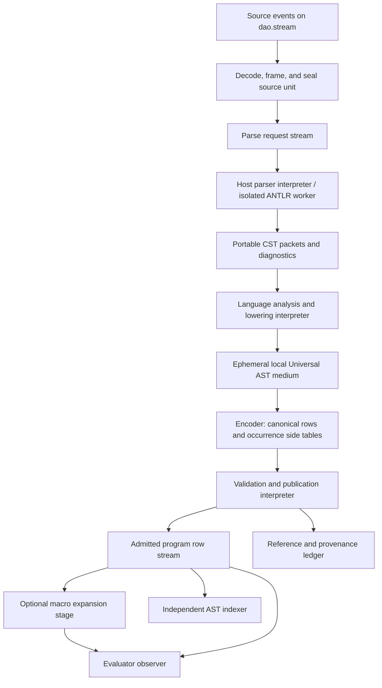

I’ll read the repository’s architectural contracts and current compiler code, then verify ANTLR’s host support and packaging constraints before drafting the plan. I won’t edit repository files.

The code-as-tuples design makes a key distinction: frontends construct an ephemeral map AST, but streams carry flat content-addressed code rows; datoms hold references and provenance. I’ll preserve that separation and distinguish ANTLR’s synchronous parsing from a non-blocking stream interface.

The Python and PHP frontends are handwritten parsers with limited lowering, so ANTLR alone would not provide full language compatibility. The plan will give each plugin explicit syntax and semantic support profiles, and use one stream-based parsing contract for both local runtimes and optional compilation services.

I found some drift between the design text and current code: the encoder, row loaders, and macro packet format already exist, while parts of the design still describe them as future work. I’ll identify those integration points explicitly. The roadmap will also test the SPI with a fifth language and cover chunk boundaries, backpressure, recovery, and cross-host semantic parity.

Completed-GMT: 2026-09-23 17:55:21 GMT
Completed-Local: 2026-09-24 00:55:21 ICT

# Architectural Plan: Extensible ANTLR Frontends for Yang over DaoStream

**Status:** Proposed architecture and implementation roadmap. Repository files were not edited.

The architectural decision is to make Yang an **open compiler composition framework**. Each language contributes a versioned grammar package, a syntax export contract, semantic analysis and lowering, and any required runtime prelude. Java, Python, PHP, and JavaScript are reference implementations of this contract. Yang core contains no enumeration of supported languages.

ANTLR operates behind a stream boundary. Its generated parsers and runtime objects remain host-local. Parsing produces portable syntax data; language interpreters lower that data to Yin's existing Universal AST; the established encoder produces canonical content-addressed rows. Evaluation, indexing, persistence, diagnostics, and tooling remain independently composed observers.

**An ANTLR grammar supplies syntax recognition. Executable language support additionally requires a semantics-preserving lowering and runtime profile.** The framework must make this distinction observable.

## 1. Repository baseline and governing decisions

The plan follows the axioms and six invariants in [datom.world.md](/Users/sto/workspace/datomworld/docs/design/datom.world.md), the passive substrate contract in [dao.stream.md](/Users/sto/workspace/datomworld/docs/design/dao.stream.md), and the representation rules in [yin.vm.code-as-tuples.md](/Users/sto/workspace/datomworld/docs/design/yin.vm.code-as-tuples.md).

The inspected implementation establishes these starting points:

- [yang.clojure](/Users/sto/workspace/datomworld/src/cljc/yang/clojure.cljc) already emits named Universal AST maps and lowers definitions to explicit `yin/def` applications.
- [yang.python](/Users/sto/workspace/datomworld/src/cljc/yang/python.cljc) and [yang.php](/Users/sto/workspace/datomworld/src/cljc/yang/php.cljc) contain handwritten tokenizers, parsers, and limited lowering. Replacing their parsing does not automatically repair their semantic limitations.
- JavaScript is described as future work in the Yang documentation; no corresponding frontend was found in the inspected Yang source directory.
- [yin.vm](/Users/sto/workspace/datomworld/src/cljc/yin/vm.cljc:795) already defines the canonical row grammar, projection, reconstruction, validation, occurrence relations, and requirement extraction.
- [yin.vm.encoder](/Users/sto/workspace/datomworld/src/cljc/yin/vm/encoder.cljc) already separates frontend maps from row output. Its forwarding path currently throws on unsuccessful appends; a general compiler pipeline needs explicit staging and outcome handling.
- The current macro pipeline consumes `[:yin.program/batch trees run-index declaration-rows harvest-rows]`. Row loaders and a row-native macro expander exist despite older design passages describing them as future work.
- [the REPL dispatcher](/Users/sto/workspace/datomworld/src/cljc/yin/repl/core.cljc:640) currently selects Clojure, Python, and PHP with a closed `case`. Migrating this consumer to the SPI is part of the work.

The historical [Yang implementation summary](/Users/sto/workspace/datomworld/src/cljc/yang/docs/yang_implementation.md) supplies context, not proof of present feature completeness or portability.

### 1.1 Representation decision

The term “Universal AST datoms” must preserve the repository's distinction between semantic code, stored code, and references:

1. **Universal AST maps** are the frontend's semantic representation and the walker's reconstructed image.
2. **Flat rows `[id tag & slots]`** are canonical code content exchanged across durable or remote compiler boundaries.
3. **Datoms `[e a v t m]`** record naming, publication, provenance, diagnostics, and optional derived EAV projections.

Do not introduce a second authoritative AST schema in which each language persists its own node attributes.

The design text contains conflicting descriptions of map ASTs traveling on streams. This plan reconciles them as follows: the existing frontend-to-encoder map medium may remain an **ephemeral, host-local staging stream**. Persistent or remote program exchange carries canonical rows. Phase 0 must document this interpretation and verify it against the existing encoder and macro pipeline.

### 1.2 Invariant enforcement

- **No hidden global state:** frontend catalogs, installed implementations, configuration, allocation counters, and caches belong to an explicit composition or worker.
- **No implicit control flow:** admission, parse completion, retries, cancellation, publication, and execution are represented by state transitions and stream records.
- **No application callbacks:** host events are classified into data and deposited. Portable interpreters poll their own cursors.
- **No shared mutable state:** compiler state is immutable and threaded explicitly. ANTLR's mutable machinery is confined to an exclusively owned host worker.
- **No collapse of interpretation and execution:** streams do not parse, compile, schedule, or evaluate; compilation does not execute the user's program.
- **No assumed graphs:** CST child edges, module dependencies, object references, and code relationships are explicit data. Interpreters construct the corresponding relations.

## 2. Overall composition



The direct evaluator route and macro route are composition alternatives. A composition must not feed both into one evaluator and execute the program twice.

Every substantial stage communicates through a supplied stream. Pure helper functions inside a stage may share algorithms; they do not become a hidden route between stages or across hosts.

Diagnostics and lifecycle records use separate supplied streams or explicitly framed topics. `dao.stream` does not route records by language or payload type.

## 3. Open Language Frontend SPI

### 3.1 Separate portable declarations from installed implementations

A frontend consists of four independently versioned parts:

1. **Grammar package:** lexer/parser grammars, imports, token vocabulary, entry rules, and required parsing helpers.
2. **Syntax export profile:** how the generated parser's CST becomes portable data.
3. **Semantic frontend:** scope analysis, validation, desugaring, and Universal AST lowering.
4. **Runtime profile:** prelude code, value representations, calling convention, primitive requirements, and permitted effects.

A proposed portable manifest might contain:

```clojure
{:yang.frontend/id :example.ruby/frontend
 :yang.frontend/spi 1
 :yang.frontend/revision "<immutable-package-revision>"
 :yang.frontend/language :example.ruby/language

 :yang.frontend/grammar
 {:yang.grammar/package "<content-address>"
  :yang.grammar/lexer "RubyLexer"
  :yang.grammar/parser "RubyParser"
  :yang.grammar/entries
  {:module "program"
   :expression "expression"}
  :yang.grammar/export-profile :yang.cst/v1}

 :yang.frontend/options-schema "<content-address>"
 :yang.frontend/lowering-profile "<content-address>"
 :yang.frontend/runtime-profile "<content-address>"
 :yang.frontend/support-profile "<content-address>"}
```

These names are proposed SPI vocabulary, not existing repository APIs. The strings identify grammar declarations; they are not classes to instantiate from untrusted input.

Host installation separately binds an admitted package revision to:

- Generated JVM classes, JavaScript modules, or Dart libraries.
- The corresponding ANTLR runtime.
- Any target-specific lexer/parser helper implementation.
- A portable lowering implementation, or an explicitly selected lowering service.
- Supplied request, response, control, and diagnostic streams.

Portable manifests contain no constructors, function objects, classloaders, callbacks, or live handles.

### 3.2 Registration and selection

Registration means constructing a new catalog value:

```clojure
catalog' = install(catalog, validated-manifest, installed-binding)
```

This is not namespace-load registration or mutation of a global registry.

The composition supplies the catalog to the compiler coordinator. A request selects a frontend revision and dialect explicitly. Filename extensions and content detection can propose a frontend, but ambiguous detection produces a diagnostic or a choice record rather than silently choosing.

In-flight requests pin a catalog snapshot. Installing a newer frontend does not change their behavior.

A missing frontend, missing entry rule, incompatible SPI, unknown required option, or unavailable parser implementation produces a qualified compiler outcome. None causes automatic dependency downloading or executable plugin loading.

### 3.3 Support profiles

Each frontend publishes separate claims for:

- Syntax recognition by language edition and entry rule.
- Semantic analysis.
- Executable lowering.
- Standard-library compatibility.
- Host and effect requirements.
- REPL completeness detection.
- Optional incremental parsing.

Features can be declared supported, intentionally restricted, or unsupported, with test identifiers attached to supported claims.

A grammar may recognize generators, reflection, or ownership syntax before Yang can execute them. Such constructs must produce an unsupported-feature diagnostic at the semantic gate, never a superficially valid AST with altered meaning.

### 3.4 Lowering contract

The frontend consumes a sealed, validated CST packet and an explicit compilation environment. Its logical transition is:

```text
step(state, observed-input, budget)
  -> successor-state
   + staged-output
   + status
```

State includes the work stack, scope environment, module facts, deterministic name supply, intermediate values, and pending outputs.

Lowering can use:

- Declarative patterns over rule names and child roles.
- An explicit stack-based tree walker.
- Pure visitor functions over normalized data.

Generated ANTLR visitors may help **export syntax inside the host boundary**. They must not invoke portable lowering with `ParserRuleContext` objects.

Unknown or unhandled CST constructs are errors. A default visitor that silently drops children is not acceptable compiler behavior.

If a frontend separates analysis and lowering into independently driven stages, it introduces a stream boundary between them. If they share one interpreter, their intermediate representation remains private, regenerable state.

### 3.5 Adding a language without core changes

A third-party author must be able to:

1. Package a grammar and audited dependencies.
2. Declare entry rules, dialect options, and syntax export profile.
3. Supply a lowering and runtime profile.
4. Pass the frontend conformance kit.
5. Add the package to a composition's catalog.

This changes deployment configuration and adds a plugin package. It does not add a language-specific branch to Yang core, DaoStream, the canonical AST grammar, or evaluator dispatch.

Clojure should implement the same frontend contract through its existing reader. The open SPI should not require every frontend to use ANTLR.

## 4. ANTLR runtime boundary and host portability

### 4.1 One protocol, several deployments

Use a **stream-based parsing service contract**, implemented locally when a suitable runtime is available and through an explicitly configured service otherwise.

ANTLR has a Java-based generation tool and target runtimes including Java, JavaScript, TypeScript, and Dart. Target feature parity is not automatic. Generation and runtime execution are separate concerns. [ANTLR target documentation](https://github.com/antlr/antlr4/blob/dev/doc/targets.md)

The proposed deployment policy is:

```text
+----------------+--------------------------------------+----------------------------------------+
| Consumer host  | Local parser implementation          | Alternative                            |
+================+======================================+========================================+
| JVM / CLJ      | Generated Java parser in an isolated | Configured parsing service             |
|                | worker or worker process             |                                        |
+----------------+--------------------------------------+----------------------------------------+
| Node / CLJS    | Generated JavaScript parser in a     | Local sidecar or remote service        |
|                | worker; TypeScript compiled at build |                                        |
+----------------+--------------------------------------+----------------------------------------+
| Dart / CLJD    | Optional generated Dart parser in an | Sidecar where supported, or a remote   |
|                | isolate                              | service; otherwise unsupported outcome |
+----------------+--------------------------------------+----------------------------------------+
```

A CLJD application can compile through a service without bundling ANTLR. It can also consume previously compiled rows without any parser.

Full offline local compilation on all three hosts requires validated parser artifacts for all three. Service-based portability must not be advertised as offline portability.

Source is sent only to an endpoint supplied by the composition. Unavailability does not trigger an undisclosed remote fallback.

### 4.2 What remains host-local

The worker exclusively owns:

- Lexer and parser instances.
- Character/token streams.
- ANTLR contexts, tokens, ATN/DFA structures, and prediction caches.
- Target-specific indentation, lexical-mode, or predicate helpers.
- Exceptions, worker handles, and process resources.

Generated recognizers may use shared caches. The implementation must audit these and isolate them by worker/process/classloader or provide instance-owned caches where supported. Merely constructing a fresh parser is insufficient evidence that mutable runtime state is isolated.

Read-only generated tables may be shared. No semantic state may depend on a previous request.

The boundary adapter itself remains a map of host-event-to-data transformations supplied with a deposit operation. The host parser interpreter owns execution; the depositing adapter does not schedule lowerers or call clients.

ANTLR's internal parsing methods and semantic predicates are internal library execution. They are not a license to introduce application callbacks across the stream boundary.

### 4.3 Non-blocking interfaces versus synchronous parsing

ANTLR parsing is not inherently a resumable, fuel-metered computation. Its parser entry methods perform synchronous work; an unbuffered character stream is not a portable asynchronous continuation protocol. [ANTLR parser implementation](https://raw.githubusercontent.com/antlr/antlr4/4.13.2/runtime/Java/src/org/antlr/v4/runtime/Parser.java), [UnbufferedCharStream API](https://www.antlr.org/api/Java/org/antlr/v4/runtime/UnbufferedCharStream.html)

Therefore:

- A portable compiler step never invokes an unbounded parse on the caller's event loop.
- It appends a request and later observes response events.
- Parsing runs in an isolated worker, process, or service.
- The host completion handler deposits data and returns.
- Cancellation is an explicit control record. Hard termination requires a host mechanism that can actually stop the worker; thread interruption alone is not assumed sufficient.

The portable compilation state can checkpoint at request and packet boundaries. A native ANTLR call stack is not a Yin continuation and is not migrated. Recovery replays the immutable source snapshot in another worker.

### 4.4 Build, packaging, ASCII, and licensing

Generate parsers during reproducible builds, not while admitting source programs.

Pin:

- Grammar source revisions and digests, including imported grammars.
- Tool and runtime versions.
- Generation flags and target.
- Helper implementations and patches.
- Syntax export and diagnostic normalization profiles.
- Generated artifact digests.

ANTLR releases coordinate the tool and runtimes; upgrades should regenerate and retest the complete parser package. [ANTLR versioning policy](https://github.com/antlr/antlr4)

Prefer grammars without embedded target-language actions. Where indentation or lexical ambiguities require helpers, version and test those helpers per target. The grammars-v4 project expresses an action-free expectation, not a guarantee that every grammar works unchanged on every target. [grammars-v4](https://github.com/antlr/grammars-v4)

For the requested ASCII policy:

- Keep maintained grammar syntax, generated textual parser sources, manifests, and patches ASCII.
- Express non-ASCII grammar characters through ANTLR Unicode escapes.
- Reject non-ASCII generated text in CI unless an audited, target-aware transformation preserves behavior.
- Preserve upstream notices exactly; do not silently transliterate or remove legally required text.
- Keep source programs Unicode-capable. An ASCII grammar file does not imply an ASCII language.

ANTLR documents Unicode escapes in lexer rules. [ANTLR lexer rules](https://raw.githubusercontent.com/antlr/antlr4/4.13.2/doc/lexer-rules.md)

License review covers each grammar, imported grammar, helper, runtime, and fixture independently. Retain source and binary notices, record SPDX identifiers where known, and block redistribution when licensing is missing or incompatible. ANTLR's own license does not license every community grammar. [ANTLR license](https://raw.githubusercontent.com/antlr/antlr4/4.13.2/LICENSE.txt), [grammars-v4 licensing guidance](https://github.com/antlr/grammars-v4/blob/master/House_Rules.md)

## 5. Source ingestion and portable syntax protocol

### 5.1 Source units are explicit

Use a versioned source vocabulary with events such as:

```clojure
{:yang.source/event :yang.source/chunk
 :yang.source/unit ["session-token" 7]
 :yang.source/revision 3
 :yang.source/ordinal 0
 :yang.source/text "def f(x):\n"}

{:yang.source/event :yang.source/seal
 :yang.source/unit ["session-token" 7]
 :yang.source/revision 3
 :yang.source/chunk-count 1}
```

The complete protocol also defines begin, abort, byte-chunk, and snapshot-reference forms.

Rules:

- Every chunk belongs to one unit revision and has an explicit ordinal.
- Duplicate identical chunks can be deduplicated; conflicting duplicates fail.
- A seal fixes the source snapshot. Missing chunks prevent admission.
- Stream `blocked` means no event yet, never language EOF.
- Stream `end` before a required seal is truncated input.
- A shared REPL stream remains open between submissions.
- Source edits append new revisions; they do not mutate previous source.

File readers and interactive input adapters deposit source events. Lowering never reads a filesystem or terminal directly.

### 5.2 Encoding and source coordinates

Default new text submissions to a documented encoding, normally UTF-8. Language-specific source encoding declarations require a versioned decoding policy.

Raw byte chunks must use an agreed portable representation, such as vectors of byte values or content references, rather than host byte-array objects. Incremental decoding retains incomplete multibyte sequences between chunks.

Canonical spans use half-open offsets into the original source bytes. Host character offsets, code-point positions, UTF-16 indexes, and inclusive token end positions are converted at the boundary. Line and column values are presentation projections.

Preserve original source and transformation maps for language preprocessing, including Unicode escapes, indentation processing, or mixed-code regions. Do not normalize line endings or Unicode text silently.

Large source units may spool through a supplied content service. Content lookup and materialization must themselves use stepped request/response interfaces where they can wait.

### 5.3 Streaming is initially by complete compilation unit

Baseline ANTLR integration buffers or spools a sealed unit before parsing. It does not equate a chunk with a parseable statement.

This matters for indentation, multiline strings, comments, lexical modes, automatic semicolon insertion, and syntax that depends on later tokens.

The architecture supports:

- Streaming source ingestion.
- Concurrent compilation of independent sealed units.
- Chunked CST and code delivery.
- Bounded compiler turns.

It does not initially promise arbitrary mid-rule parser suspension or incremental reparsing.

REPL frontends can publish a completeness probe returning complete, incomplete, or invalid. A blanket “error at EOF means incomplete” rule is unsound. Where a reliable probe is unavailable, use an explicit submit action.

### 5.4 Portable CST packets

The syntax exporter emits a versioned packet containing:

- Request, source revision, and grammar profile identity.
- A root occurrence identifier.
- Flat rule and terminal records.
- Ordered child references.
- Source spans and token vocabulary names.
- Explicit recovery/error records where applicable.
- A completion record identifying the complete packet.

CST identifiers are deterministic within a packet, for example preorder ordinals. They are not ANTLR object identities.

Rule names and declared labels are preferable to target class names. Raw numeric token IDs require the pinned vocabulary. Alternative labels are emitted only where the exporter can obtain them reliably; the contract must not assume every runtime preserves an alternative number.

Lexemes can be recovered from source spans and normally need not be copied. Synthetic recovery tokens require explicit text and an insertion coordinate.

The CST is a **regenerable compiler artifact**, not a new canonical Universal AST. Retention for debugging is an explicit composition policy. Child edges are data; tree structure is validated before traversal.

## 6. DaoStream interpreter mechanics

### 6.1 Explicit state and bounded work

Each interpreter owns:

- Opaque cursors for its inputs.
- Pinned profiles and dependency snapshots.
- An explicit work queue or traversal stack.
- Staged output and the next output index.
- Request/attempt identities.
- Resource counters and terminal status.

A proposed driver-facing interface is:

```text
compiler-step(stream-handles, state, work-budget)
  -> {:yang.compile/state ...
      :yang.compile/status ...
      :yang.compile/progress ...}
```

Handles stay in host-local composition. Portable state carries identities and descriptors where needed; it does not serialize handles.

Budgets cover reads, transitions, writes, and work on large structures. Existing synchronous encoding, hashing, validation, or query helpers must be made stepped or run in workers when their input can be large. Adding a `budget` argument around an unbounded recursive function is insufficient.

The caller drives steps. Cadence or `dao.stream.waitset` can reduce idle polling, but no interpreter requires a readiness extension.

### 6.2 Respect the existing outcome algebra

Compiler outcomes and DaoStream outcomes occupy different layers:

```clojure
;; Successful observation of a failed compilation.
{:dao.stream/outcome :dao.stream/ok
 :dao.stream/value
 {:yang.compile/outcome :yang.compile/rejected
  :yang.compile/request ["client-token" 12]
  :yang.compile/reason :yang.compile/syntax-error}
 :dao.stream/cursor successor}
```

Do not invent `:dao.stream/syntax-error` or extend DaoStream's seven operations.

The compiler handles stream outcomes as follows:

```text
+--------------------------+-------------------------------------------------------------+
| Outcome                  | Compiler action                                             |
+==========================+=============================================================+
| next: ok                 | Incorporate input into explicit state and record disposition|
+--------------------------+-------------------------------------------------------------+
| next: blocked            | Preserve state and cursor; yield                            |
+--------------------------+-------------------------------------------------------------+
| next: end                | Apply source/stage framing rules; never invent a seal       |
+--------------------------+-------------------------------------------------------------+
| next: gap                | Fail the affected attempt or replay a verified snapshot     |
+--------------------------+-------------------------------------------------------------+
| next: cursor defect      | Report wiring/protocol failure                              |
+--------------------------+-------------------------------------------------------------+
| append: ok               | Commit this staged write locally                            |
+--------------------------+-------------------------------------------------------------+
| append: full             | Retain the identical staged value; yield                    |
+--------------------------+-------------------------------------------------------------+
| append: closed or        | Record delivery failure; do not discard or rerun lowering  |
| invalid-value            |                                                             |
+--------------------------+-------------------------------------------------------------+
| transport-error          | Preserve the result and apply explicit recovery policy     |
+--------------------------+-------------------------------------------------------------+
```

Cursor advancement follows the repository's disposition rule: either output has been accepted, or the successor state fully owns the consumed input and its pending work. A crash-safe variant additionally needs durable checkpointing or replay with deduplication.

Retries of rejected appends preserve payload and identity. They do not rerun parsing, allocate fresh names, or duplicate diagnostics.

### 6.3 Admission and publication are distinct

Compilation stages use candidate media. Evaluators observe only the admitted program medium.

Publication requires:

1. A sealed source snapshot.
2. Complete parser output and diagnostic status.
3. Successful semantic analysis and lowering.
4. Complete canonical row closure.
5. Structural and content-integrity validation.
6. A pinned runtime/dependency profile.
7. A terminal successful admission decision.

For large artifacts, stage chunks with a manifest and completion record. An admission interpreter reconstructs or resolves the complete artifact before making it executable. A partially delivered prefix is never a program.

Persisting candidate rows before success is permissible, but creates no execution authorization or published name.

There is no cross-stream transaction supplied by DaoStream. If code, provenance, and refs must all be retained before publishing a name, the publication interpreter waits for their explicit receipts. It does not infer remote durability from `append!` returning `ok`.

### 6.4 Retention, duplication, cancellation, and restart

Source, candidate, and required-diagnostic media need declared retention sufficient for their correctness obligations. Do not substitute a large evicting ring buffer for complete history.

A host callback deposit destination must admit every event allowed by the boundary's admission budget. Use explicit capacity reservation or a suitable complete-history destination; never silently drop a diagnostic when a callback cannot retry.

Request identity and attempt identity are different:

- Retransmitting one request retains its request ID.
- Replaying a lost parse may create a new attempt ID.
- Semantic output identity excludes both.
- Diagnostic and lifecycle records retain attempt identity.

Application-level acknowledgments and deduplication handle uncertain remote delivery. DaoStream does not promise exactly-once remote execution or durable append.

Cancellation travels on a control stream. The coordinator records cancelled state, requests worker termination, and declines to admit late results. It closes only resources it owns.

Cursors remain opaque. Cross-host restart must not assume transport-independent cursor serialization, which the current stream contract leaves unresolved. Portable recovery uses snapshot identities and explicit event ordinals, then obtains valid cursors from the destination composition.

## 7. Universal AST encoding, provenance, and derivation

Lowering constructs only nodes admitted by `yin.vm/semantic-bytecode-grammar`. Class, generator, prototype, pointer, and language-specific scope nodes are not added merely for frontend convenience.

For example, an ephemeral map:

```clojure
{:type :application
 :operator {:type :variable :name 'example.runtime/add}
 :operands [{:type :literal :value 1}
            {:type :literal :value 2}]
 :tail? false}
```

projects to flat rows:

```clojure
[A :application B [C D] false]
[B :variable example.runtime/add]
[C :literal 1]
[D :literal 2]
```

`A` through `D` are schematic addresses computed from row bodies.

The encoder owns saturation, projection, and occurrence side tables. Frontends do not implement competing hash schemes.

### 7.1 Existing integration points

Reuse:

- `yin.vm/ast->semantic-bytecode`.
- `yin.vm/validate-rows` plus content-address verification.
- `yin.vm/semantic-bytecode->ast`.
- `yin.vm/ast-side-tables` and `occurrences`.
- `yin.vm.encoder` batch construction.
- `yin.vm.linearize/lower-rows`.
- Existing row loaders and macro packet conversion.

Shape validation alone is not hash verification. Both are required before accepting artifacts from a service.

Phase 0 must settle the explicit conversion between provenance-bearing encoder envelopes and current macro packets. In particular, origin, batch member index, harvest order, and side-table ownership must survive conversion. Do not introduce an undocumented third program format.

Macro expansion remains optional topology. Python decorators and JavaScript calls are not automatically Yin macros.

### 7.2 Derive rather than duplicate

Do not add canonical fields for:

- Source language or filename.
- Parent links and depth.
- Free/bound classification.
- A repeated root marker.
- Cached call graphs.
- Types erased by lowering.
- Dependencies already derivable from rows and runtime profiles.

Free-name queries must remain root- and occurrence-scoped. A shared variable row can be bound at one occurrence and free at another.

Facts not recoverable after lowering, such as original source spans or source-level type annotations, belong in occurrence side tables. Facts required for execution, such as a class's runtime dispatch data, belong in executable prelude values or program data. “Derive” must not erase required semantics.

### 7.3 Provenance

Use the repository's occurrence coordinate:

```clojure
[[:source program-medium batch-token member-index]
 root-address
 structural-path]
```

This is separate from the original source-file revision. Record the link from the program admission occurrence to the source snapshot and frontend profile.

A compilation derivation record pins source, grammar, normalization, lowering, runtime profile, dependency snapshot, and output roots. Its address is published through ordinary ledger datoms.

Content addresses occupy `v`, not `e`. The transactor owns persistent local IDs and transaction time. Optional AST datom projections remain regenerable query views and never become the load identity.

## 8. Semantic lowering across paradigms

### 8.1 Shared semantic foundation

The common target is a small computation language with explicit language runtime libraries.

The reference semantic ABI should define:

- Evaluation order.
- Argument binding and arity checks.
- Language value encodings.
- Identity and aliasing.
- Scope and initialization states.
- Normal and abrupt completion.
- Effect requests and responses.
- Suspend/resume behavior.

Do not inherit Clojure truthiness, equality, integer arithmetic, or argument binding merely because the frontend is implemented in Clojure.

A practical baseline is an explicit state-passing and continuation-based lowering:

- Immutable heap state is threaded through guest operations.
- References are logical identities into that state.
- Loops and control transfers become lambdas, applications, and conditionals.
- Abrupt completion is explicit, for example normal, return, throw, break, continue, or yield.
- Suspended state consists of portable code references and data.

Aliased guest objects share logical identity, not host mutable objects. Concurrent access to a guest heap has one owning interpreter or an explicitly defined stream protocol.

Generated names come from a deterministic, capture-avoiding name supply in compiler state. Namespace-global `gensym` counters, request IDs, source positions, and host map iteration order must not affect canonical code.

The existing AST's `:vm/store-put` value is data, not an evaluated child. Dynamic assignment must use a supported effectful application or the explicit state ABI; inserting an AST under `:val` would store syntax.

Runtime values must also avoid accidental interpretation as engine effects. Use a defined tagged value representation so a guest object containing a property named `effect` cannot trigger `module/effect?`.

### 8.2 Placement of semantics

**Compiler desugaring** handles syntax-directed control, binding analysis, static checks, evaluation order, and construction of runtime operations.

**Portable prelude code** handles object systems, dispatch, coercions, collections, language exceptions, argument binding, and other language-visible behavior. Prefer Universal AST code so behavior is inspectable and portable.

**Profiled pure primitives** can accelerate expensive value operations when implementations have equivalent behavior across hosts.

**Yin FFI/effects** handle actual host interaction: files, sockets, timers, processes, external libraries, and native resources. They are stream request/response protocols with declared capabilities.

Calling a host's native Python, JVM, or JavaScript evaluator is a separate compatibility service profile. It does not establish that the program was compiled into portable Yin semantics.

### 8.3 Java: static typing and class-based objects

The Java frontend performs declaration collection, resolution, type checking, overload selection, access checks, and relevant definite-assignment checks before executable lowering.

Classes become runtime descriptors plus explicit fields, method code, constructor logic, and initialization state. Interfaces contribute type constraints and dispatch contracts. Virtual calls use runtime dispatch; overload resolution remains a compile-time responsibility. Evaluation order must follow the selected Java edition. [Java Language Specification, expressions](https://docs.oracle.com/javase/specs/jls/se25/html/jls-15.html)

The prelude must define:

- Primitive numeric widths, overflow, conversions, and comparisons.
- Object identity, null behavior, arrays, and bounds failures.
- Inheritance, interface dispatch, and method invocation.
- Static members and class initialization lifecycle.
- Language exceptions and cleanup behavior.

Typed variables do not require a new canonical node tag. Erased checking information remains analysis data; runtime-observable type information becomes explicit program values.

Reflection, class loading, monitors, threads, and JNI require additional support profiles. A class-based subset must not be labeled full JVM compatibility.

### 8.4 Python: indentation and dynamic values

Python is dynamically typed, but ordinary name resolution is based on lexical scopes with explicit `global` and `nonlocal` rules. It is not generally dynamically scoped. Whole-block binding analysis is needed to distinguish local variables and unbound-local errors. [Python execution model](https://docs.python.org/3/reference/executionmodel.html)

The frontend and prelude divide responsibilities as follows:

- Indentation, line joining, and lexical state belong to the grammar package and its parsing helpers.
- Scope analysis precedes lowering.
- Assignments update explicit binding cells or threaded state; nested lambdas alone do not implement mutable captured variables.
- `and` and `or` preserve short-circuiting and return operand values.
- Comprehensions preserve evaluation order and their dialect-specific scope.
- Decorator expressions and application order are explicit; execution occurs when the definition is evaluated.
- Default arguments, keyword arguments, and variadic binding use Python's calling rules.
- Generators lower to explicit resumable state machines, including completion and injected exceptions.

Truthiness, arbitrary-precision integers, division, equality, attribute lookup, descriptors, and iteration belong to the Python runtime profile.

Generator support is incomplete until `send`, `throw`, `close`, cleanup, and suspension are tested. It is not established by parsing `yield`.

### 8.5 PHP: mixed text, ordered maps, and request state

The lexer uses modes to preserve HTML/text and PHP regions in source order. Text outside code lowers to ordered output effects; it is not discarded by stripping tags.

PHP arrays require ordered-map behavior, including key conversion and iteration rules. A plain host hash map is not a sufficient representation. [PHP array documentation](https://www.php.net/types.array)

The semantic profile must cover:

- `$var` binding and function/global/static scope.
- Capture by value versus capture by reference.
- References and aliasing.
- Ordered arrays and observable copy behavior.
- Coercion, comparisons, missing values, and error behavior.
- Function and class calls, including supported type declarations.

Superglobals are explicit request-context values supplied by the composition. They do not read ambient process or HTTP state.

`include` and `require` perform module-resolution effects with recorded inputs. `eval` is a new compilation request, subject to the same profiles and diagnostics.

The existing frontend's ignored type hints and limited closure handling are migration limitations, not semantics to preserve as the new default.

### 8.6 JavaScript: lexical environments and asynchronous jobs

The frontend distinguishes script and module goals and pins an ECMAScript edition.

It lowers:

- `var` bindings and initialization.
- `let` and `const`, block environments, and temporal dead zones.
- Per-iteration bindings where required.
- Ordinary functions versus arrow functions, including `this` behavior.
- Property access, receiver binding, and prototype lookup.
- Short-circuiting and completion propagation.

The prelude defines property descriptors, prototype chains, coercion, equality, `undefined`, numeric behavior, and other supported object operations. ECMAScript environment records and execution contexts supply the semantic reference. [ECMAScript execution contexts](https://tc39.es/ecma262/multipage/executable-code-and-execution-contexts.html)

Promises and `async`/`await` require an explicit job interpreter. A language-level callback is represented as guest callable data scheduled by that interpreter. It is never installed directly as a host callback.

Observable job ordering, rejection propagation, and suspension must be tested separately from successful value computation. Browser APIs and Node APIs are effect packages, not properties of the JavaScript grammar.

### 8.7 Go, Rust, C, and further extensions

Future system-language frontends reuse the SPI but contribute additional semantic analysis and runtime profiles:

- Structures and value copying.
- Logical references, explicit memory regions, and layouts where observable.
- Pattern matching and exhaustiveness checks.
- Ownership, borrowing, moves, and destruction where applicable.
- Defined panic/unwind or error behavior.

Go's value and reference-bearing types need their specified copying behavior; goroutines and channels require a language scheduler above streams rather than treating a broadcast log as a destructive channel. [Go specification](https://go.dev/ref/spec)

Rust requires ownership and lifetime analysis beyond parsing, plus explicit drop behavior. Those analyses may be an additional service stage without changing the frontend SPI. [Rust ownership documentation](https://doc.rust-lang.org/book/ch04-00-understanding-ownership.html), [Rust destructors](https://doc.rust-lang.org/reference/destructors.html)

Raw native pointers are host capabilities, never portable literals. Unsafe/native operations need a separately declared profile.

C preprocessing, Rust macro expansion, SQL dialect resolution, TypeScript checking, and Ruby dynamic dispatch are plugin-owned stages. Each has explicit inputs, outputs, and dependencies. None requires Yang core to recognize its language by name.

### 8.8 Cross-language calls

A common AST does not imply a common object model.

Interop exports need an explicit ABI describing scalar conversion, strings, numeric ranges, callable arguments, exceptions, object handles, ownership, and asynchronous results.

Start with a small portable-value interop profile. Rich object sharing requires adapters; JavaScript `null`, Python `None`, PHP `null`, and Java null references must not be conflated accidentally.

## 9. Diagnostics and error handling

ANTLR's default behavior combines error reporting and recovery. Console reporting is supplied by a listener, while recovery may insert/delete tokens, continue, or raise recognition errors. The integration must control both mechanisms. [ConsoleErrorListener](https://raw.githubusercontent.com/antlr/antlr4/4.13.2/runtime/Java/src/org/antlr/v4/runtime/ConsoleErrorListener.java), [DefaultErrorStrategy](https://www.antlr.org/api/Java/org/antlr/v4/runtime/DefaultErrorStrategy.html)

### 9.1 Boundary policy

For lexer and parser:

1. Remove default console listeners.
2. Install boundary transformations that classify diagnostics as plain data.
3. Select a pinned recovery strategy.
4. Catch recognized parsing failures at the host boundary.
5. Export recovery markers and terminal parse status.
6. Retain no exception, recognizer, token, or host stack object in payloads.

A default strict profile refuses executable publication after any lexical or syntax error, even when ANTLR constructed a recovered CST. An IDE profile may publish partial syntax for tooling on a separate medium.

Worker crashes, timeouts, resource exhaustion, grammar incompatibility, and internal defects remain distinct from invalid source.

### 9.2 Proposed diagnostic record

```clojure
{:yang.diagnostic/code :yang.python/unbound-local
 :yang.diagnostic/phase :yang.compile/analyze
 :yang.diagnostic/severity :yang.diagnostic/error
 :yang.diagnostic/request ["client-token" 12]
 :yang.diagnostic/attempt ["worker-token" 4]
 :yang.diagnostic/source ["source-unit" 3]
 :yang.diagnostic/span {:start-byte 41 :end-byte 42}
 :yang.diagnostic/arguments {:name "x"}}
```

Messages are rendered from stable codes and arguments. Native ANTLR wording may be retained as supplemental text, but it is not the cross-host diagnostic identity.

Normalize expected-token sets, synthetic-token positions, EOF spans, and diagnostic ordering. Use stable source and phase order, with a deterministic tie-breaker. Streaming arrival order remains operational history, not semantic ordering.

Persist diagnostic datoms through a diagnostic-ledger interpreter. The ledger allocates local entity IDs and timestamps. The parser does not place UUIDs or content hashes in datom `e`.

Cross-target recovery can differ. A frontend advertises diagnostic parity only for the conformance level it passes; exact recovery parity may require a shared strategy or a designated parser service.

## 10. Determinism, isolation, and resource controls

A reproducible compilation is a function of:

```text
source snapshot
+ source decoding and preprocessing profile
+ grammar and syntax export profile
+ language edition and options
+ semantic lowering profile
+ runtime/prelude profile
+ explicit dependency snapshot
+ target execution contract
```

Host identity, request IDs, wall-clock time, source location metadata, and incidental worker scheduling are excluded from code identity.

Module resolution consumes requests and emits pinned module artifacts. Dependency edges are explicit; linking computes reachability and strongly connected components from those edges. Environment variables, filesystem search paths, and network responses enter only as supplied or recorded inputs.

Workers enforce limits on source size, token count, nesting, parse time, CST size, diagnostics, and outstanding requests. Grammar packages containing executable helpers are admitted artifacts, not untrusted data to execute automatically.

Timeout and cancellation facts are operational events. They must not be presented as deterministic language errors.

Cross-host content-address claims remain conditional on the canonical encoding actually used. The disclosed `dao.jing` encoding residuals require explicit conformance tests and profile restrictions or fixes; this plan does not silently replace its addressing scheme.

## 11. Phased implementation roadmap

### Phase 0: SPI, ANTLR boundary, and stream pipeline

**Deliverables**

- Versioned frontend manifest, catalog, support profile, and option validation.
- Source-unit, parse-request, CST, diagnostic, cancellation, and publication protocols.
- A JVM reference parser worker behind supplied streams.
- Explicit compiler state, staged writes, replay identities, and resource accounting.
- Integration with existing encoder, row validators, and loaders.
- A generic replacement for the REPL's closed language dispatcher.
- Documented conversion between encoder envelopes and macro packets.
- ASCII, license, and reproducible-generation checks.

**Exit criteria**

- A small external grammar plugin compiles and executes without language-specific core changes.
- Two compositions can install different frontend versions without interference.
- Host objects are rejected at serialization boundaries.
- Blocked/full/gap/closed/error paths preserve state and framing.
- Recovered syntax cannot reach the evaluator.
- No test relies on a reserved readiness extension or fabricated cursor.

### Phase 1: Dynamic pilot, Python followed by JavaScript

Start with Python to migrate an existing frontend. Add JavaScript through the same extension surface.

**Deliverables**

- ANTLR parsing and explicit dialect profiles.
- Scope analysis, argument binding, truthiness, operators, sequencing, closures, and mutation.
- Portable runtime value and calling conventions.
- Python indentation and REPL framing.
- JavaScript script/module distinction, lexical environments, and prototype operations.
- Separate milestones for generators and asynchronous jobs.

**Exit criteria**

- Differential tests against pinned reference runtimes for the claimed subsets.
- Closure mutation, early returns, shadowing, short-circuiting, and arity behavior pass.
- Unsupported constructs produce stable diagnostics.
- Different chunk boundaries yield identical semantic output.
- The legacy Python frontend remains selectable until the replacement profile passes its migration gate.

### Phase 2: Java static and class-based pilot

**Deliverables**

- Declaration and dependency analysis.
- Type checking, overload resolution, and access checks for the supported subset.
- Class, interface, constructor, field, static initialization, and dispatch runtime support.
- Java numeric and exception semantics.

**Exit criteria**

- Differential tests against a pinned Java implementation.
- Tests distinguish overload selection from virtual dispatch.
- Constructors, initialization order, aliasing, null, and numeric edge cases pass.
- JVM libraries, reflection, native methods, and concurrency are explicitly supported or rejected.

### Phase 3: PHP web and associative-array pilot

**Deliverables**

- Mixed HTML/code modes.
- Ordered-array semantics and key conversion.
- Closure capture and reference behavior.
- Request-context injection and stream-based output.
- Module inclusion effects and supported type enforcement.

**Exit criteria**

- Mixed text and code preserve output order.
- Arrays preserve ordering and alias/copy semantics.
- Superglobals are reproducible from explicit request input.
- Type declarations are not silently ignored.
- Cross-request state leakage tests pass.

### Phase 4: Language Extension SDK and documentation

**Deliverables**

- Package template, manifest validator, exporter helpers, lowering examples, and prelude conventions.
- Conformance runner and support-matrix generator.
- Guides for dialects, parsing helpers, preprocessing, runtime dependencies, and diagnostics.
- License and regeneration tooling.
- A documented external installation flow.

**Exit criteria**

- Add a fifth language package, such as a clearly bounded Go or Ruby subset, outside Yang core.
- Its implementation changes no core language dispatch, AST tags, or evaluator cases.
- At least one additional grammar can be installed in syntax-only mode and honestly refuses unsupported executable lowering.
- Two dialect packages coexist without registration collisions.

### Phase 5: Multi-host verification and integration benchmarks

Host checks begin in Phase 0; this phase expands and gates the complete matrix.

**Deliverables**

- CLJ, CLJS, and CLJD compilation/evaluation tests.
- Native and service-backed parser tests where implementations exist.
- Parserless consumers loading precompiled rows.
- Fault injection for service restart, duplicate delivery, backpressure, cancellation, and incomplete packets.
- Benchmarks for ingestion, parsing, export, lowering, encoding, publication, and evaluation separately.

**Exit criteria**

- Identical admitted inputs and profiles produce equivalent normalized syntax, canonical ASTs, and semantic traces.
- Address equality is demonstrated wherever the pinned encoding profile claims it.
- No source or diagnostic loss occurs under admitted load.
- Caller-step latency remains within a declared budget while parser work runs independently.
- Resource use and service overhead are measured rather than hidden in end-to-end timing.

## 12. Verification laws and completion criteria

The conformance suite should establish these properties:

1. **Open extension:** adding a language package requires composition changes, not Yang core branches.
2. **Chunk invariance:** changing source chunk boundaries does not change a sealed unit's meaning.
3. **Deterministic compilation:** repeated compilation under the same pinned inputs produces the same canonical code.
4. **Representation round trips:** canonical `map -> rows -> map` and `rows -> map -> rows` are identities.
5. **Occurrence separation:** identical code in two source occurrences shares content identity while retaining distinct provenance.
6. **Explicit delivery:** retries preserve staged identities; partial packets never execute.
7. **Diagnostic integrity:** expected failures become data without stderr leakage or host objects.
8. **Host equivalence:** native and service-backed implementations agree within their declared profiles.
9. **Semantic preservation:** observable values, mutation, exceptions, output, and scheduling agree with the supported source-language specification.
10. **Independent observers:** compilation and evaluation work without an indexer, and indexing works without evaluation.
11. **Portable suspension:** lowering checkpoints and guest continuations resume from explicit state; native parser stacks are recovered through replay.
12. **Honest unsupported outcomes:** unavailable hosts, runtime capabilities, and language features fail explicitly.

Benchmark fixtures should include many small files, large units, deep nesting, ambiguous or malformed input, Unicode split across chunks, indentation-heavy programs, mixed PHP text, large object hierarchies, asynchronous jobs, and slow consumers. Measure throughput, peak memory, allocation, output amplification, cancellation latency, and p50/p95/p99 caller-step latency.

A pilot is complete only for its published support profile. The framework is architecturally complete when an independently packaged fifth frontend passes the same contracts and tri-host consumers can use it through local parsing, a configured service, or precompiled rows without changing Yang core.