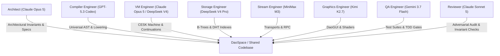

# DATOM.WORLD SOFTWARE ENGINEERING TEAM

This document defines the specialized autonomous software engineering team for **datom.world**, mapping specific roles to optimal LLM models from the [Command Code model catalog](https://commandcode.ai/docs/reference/cli/models).

## Team Roster & Model Assignment Matrix

| Role | Title | Primary LLM Model | Secondary / Fallback LLM | Key Responsibilities |
| :--- | :--- | :--- | :--- | :--- |
| **Architect** | Lead System Architect | `claude-opus-5` | `sakana/fugu-ultra` / `claude-fable-5` | Core philosophy, foundational axioms, invariants, moduli-space gauge theory, subsystem boundaries |
| **VM Runtime** | Yin.VM Runtime Engineer | `claude-opus-5` | `deepseek/deepseek-v4-pro` | CESK machine, stack & register VMs, continuations, continuation transport, runtime macros |
| **Storage & Indexing** | DaoSpace & DaoJing Engineer | `deepseek/deepseek-v4-pro` | `zai-org/GLM-5.3` | B-tree index realization, covered index nodes, DHT Kademlia, content-addressed storage, `q` / `match` |
| **Compiler & AST** | Yang Compiler Engineer | `gpt-5.3-codex` | `Qwen/Qwen3.8-Max` | Universal AST, Clojure/Python/PHP/Dart lowering, compile-time macros, syntax independence |
| **Stream & Network** | DaoStream & Protocol Engineer | `MiniMaxAI/MiniMax-M3` | `moonshotai/Kimi-K3` | Append-only log framing, WebSocket/HTTP streams, transit serialization, RPC retries & deduplication |
| **Frontend & Graphics** | DaoGUI & Postgraphics Engineer | `moonshotai/Kimi-K2.7-Code` | `deepseek/deepseek-v4-flash-vision-exp` | Event arena, gesture state machines, WebGL/WebGPU shaders, terminal canvas rasterization, browser demo |
| **QA & Verification** | Cross-Platform QA / TDD Engineer | `google/gemini-3.7-flash` | `google/gemini-3.5-flash` | Cross-platform test suite (`bb test`), TDD Red/Green/Refactor, Clojure/CLJS/CLJD test coverage, bracket balancing |
| **Review & Security** | Adversarial Reviewer & Auditor | `claude-sonnet-5` | `meta/muse-spark-1.2` | Invariant enforcement, capability-token security (ADR 0002), code style, diff audits, regression detection |
| **Subagent Workers** | High-Throughput Task Executors | `google/gemini-3.5-flash-lite` | `Qwen/Qwen3.7-Flash` / `stepfun/Step-3.5-Flash` | Fast targeted searches, bulk file edits, documentation sync, automated linters |

---

## Role Definitions & Detailed Specifications

Click into each dedicated role specification:

1. [`architect.md`](./architect.md) — **Lead System Architect** (`claude-opus-5`)
2. [`vm-engineer.md`](./vm-engineer.md) — **Yin.VM Runtime Engineer** (`claude-opus-5` / `deepseek/deepseek-v4-pro`)
3. [`storage-engineer.md`](./storage-engineer.md) — **DaoSpace & DaoJing Storage Engineer** (`deepseek/deepseek-v4-pro`)
4. [`compiler-engineer.md`](./compiler-engineer.md) — **Yang Compiler & AST Engineer** (`gpt-5.3-codex`)
5. [`stream-engineer.md`](./stream-engineer.md) — **DaoStream & Distributed Protocol Engineer** (`MiniMaxAI/MiniMax-M3`)
6. [`graphics-engineer.md`](./graphics-engineer.md) — **DaoGUI & Postgraphics Engineer** (`moonshotai/Kimi-K2.7-Code`)
7. [`qa-engineer.md`](./qa-engineer.md) — **QA, TDD & Verification Engineer** (`google/gemini-3.7-flash`)
8. [`reviewer.md`](./reviewer.md) — **Adversarial Code Reviewer & Security Auditor** (`claude-sonnet-5`)

---

## Stigmergic Collaboration Protocol

The team collaborates using the **stigmergic coordination** principles native to datom.world:

1. **Shared Substrate Over Point-to-Point Messaging**:
   - Engineers communicate through immutable artifacts, specifications in `docs/design/`, and tests in `test/`.
2. **Contract-First Development (TDD)**:
   - Before implementation, QA and Domain Engineers author failing tests (`Red`). Implementation makes them pass (`Green`) without violating non-negotiable invariants.
3. **Continuous Review & Verification**:
   - Every significant patch is evaluated by the Adversarial Reviewer (`claude-sonnet-5`) against the project's non-negotiable invariants and malleability criteria.
