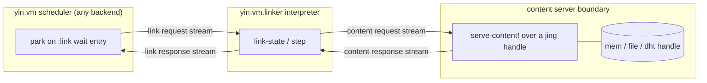
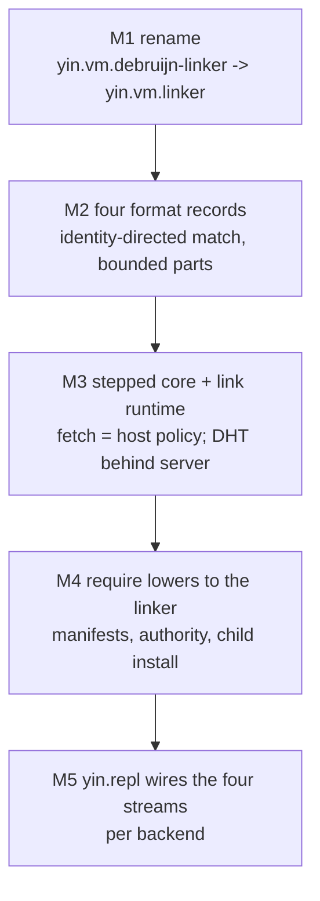

# yin.vm.linker: the universal code linker over dao.stream

Status: design, proposed (2026-09-24, revision r11). Supersedes the
namespace placement and the two-backend scope of
`yin.vm.debruijn.linker.md` (Phase B6); that document's fetch pipeline,
format records, refusal vocabulary, and same-root pairing are carried
here in substance and extended to all four `yin.vm` execution backends.
Revision r2 reconciled the adversarial review
`collab/1790250614225-reviewer-universal-linker-spec.gpt-5.6-sol.findings.md`;
revisions r3 to r11 reconcile the round-2 to round-10 consensus
reviews by `gpt-6-sol` (thread
`01a0d340-f8e7-7e30-9b74-c0a0e6b636fb`). Section
13 records each finding of every round and its resolution. Subordinate to
`datom.world.md`, `dao.stream.md`, and `dao.jing.md`. Builds on the code
identity rules of `yin.vm.universal-continuation-format.md` (UCF) section
7.3, the addressing and derivation rules of `yin.vm.code-as-tuples.md`
sections 4 and 5, and the ledger of `yin.vm.ledger`.

Related documents:

- `docs/design/yin.vm.debruijn.linker.md` - the B6 predecessor (two
  formats, one synchronous fetch)
- `docs/design/yin.vm.debruijn.stack.md` - governing decisions D5 to D16
- `docs/design/yin.vm.code-as-tuples.md` - AST rows, segment vectors,
  derivation records
- `docs/design/yin.vm.dependency-completion.md` - the work-item fixed
  point that computes a program's requirements
- `docs/design/yin.vm.universal-continuation-format.md` - code identity,
  contract stamp, safepoints, pending waits, primitive profiles
- `docs/design/dao.jing.md` - content-addressed storage and the stepped
  remote client
- `docs/design/dao.stream.md` - the stream contract, in particular OD-5

## 1. Objective and architectural position

`yin.vm` has four execution backends, all reachable from `yin.repl`
(`src/cljc/yin/repl.cljc`, `vm-constructors`):

| Backend       | Kernel                    | Code shape                   |
|---------------|---------------------------|------------------------------|
| `:ast-walker` | `yin.vm.ast-walker`       | universal AST row set        |
| `:semantic`   | `yin.vm.semantic`         | positional instruction vector|
| `:stack`      | `yin.vm.debruijn.stack`   | de Bruijn stack image (H)    |
| `:register`   | `yin.vm.debruijn.register`| de Bruijn register image (R) |

Each backend needs the same service: given an identity for some code, and
nothing else, obtain the code, prove it is the code the identity names,
prove it is well formed, prove the receiver can bind its dependencies
identically to the publisher, and hand it over for loading. Today that
service exists once, for two of the four backends, under a name that says
it belongs to one of them: `yin.vm.debruijn-linker`.

This document makes two corrections and one unification.

**Correction 1: the linker is universal.** The B6 fetch function has no
de Bruijn branch in it. It is parameterized by a format record and runs
the same six steps for a stack image and a register image. The namespace
`yin.vm.debruijn-linker` is therefore a misnomer that invites a second
linker for the semantic VM and a third for the walker. There is one
linker, `yin.vm.linker`, and every backend is a format record it takes.

**Correction 2: local and remote linking are one mechanism.** B6 already
states this (`yin.vm.debruijn.stack.md` section 7.2: "the boundary is
`dao.stream`; local and remote resolution are the same transport-neutral
mechanism"). But `fetch` today reads through a synchronous `dao.jing`
handle, and a local composition hands it an in-memory store whose `get` is
a map lookup. That is a function call across what the axioms say is a
stream boundary. This document makes the request and response a stream
exchange in every composition; what varies is the transport underneath
(ring buffer, file, WebSocket, DHT behind a served boundary), never the
linker's shape.

**Unification: `require` is linking.** Module loading in `yin.vm.module`
resolves `(require 'foo)` against a dictionary the composition built by
hand at wiring time. Linking resolves an identity to content over a stream.
These are the same operation at two grains: a module name is an entry in a
name environment whose value is a manifest address, and a manifest names
the images the linker fetches. `(require 'foo)` lowers to an effect that
parks the VM and emits a link request; the module arrives as verified
content on a response stream and is installed by a child evaluation the
scheduler owns. The dictionary becomes a manifest registry: a value naming
content addresses, never holding code that arrived by linking.

### 1.1 What this document adds over B6

1. The namespace `yin.vm.linker` and its migration from
   `yin.vm.debruijn-linker` (section 9).
2. Two new format records, `:yin.ast/code` and `:yin.semantic/code`, beside
   the two B6 records (section 5).
3. A `:parts-fn` slot in the format record so that a multi-row payload
   (an AST tree) fetches through the same pipeline as a single vector,
   with row-local validation and composition-supplied bounds before any
   child is enqueued (section 4.2, step 2).
4. Identity-directed matching: `:identity-matches-fn` replaces a bare
   hash comparison, so storage-derived identities verify under the
   algorithm the identity carries (section 4.1).
5. Dependency obligations `{name kind expected}` replacing bare free
   names, net of the module's own definitions, discharged by exact
   profile or manifest equality at the receiver (section 4.2, step 5).
6. The stepped link interface (`link-state`, `request-link`, `step`,
   `abandon`) as the portable shape, with a plain-data wire request and
   all indexes and capabilities held in linker-local state; the
   synchronous `fetch` is reclassified as host policy over an explicit
   link runtime (section 6).
7. The `:module/require` effect lowered onto the linker: two wait
   states, cursor-before-append, pair-scoped id correlation,
   installation as a scheduler child task, and export relocation by
   lift and lower with a portable module store and per-task lowering
   (section 7).
8. The module manifest, pinned to one canonical tree by content-addressed
   derivation records verified by re-lowering or explicitly trusted,
   and the manifest registry that replaces the in-memory module
   dictionary (section 8).
9. A fail-closed, proof-carrying name-authority policy for `dao.space`
   assertions, an entry criterion for M4 (section 8.2).
10. Eleven additional refusals (section 4.3).

### 1.2 What this document does not add

- No transport. `dao.stream` and its transports are the only medium.
- No peer routing, caching, or responder. `dao.jing.remote` serves
  content; `dao.jing.dht` finds it, behind that served boundary.
- No global registry, loader, or callback. Every handle, index, stream,
  and format record is an explicit argument or a value in VM state.
- No execution inside the linker. The linker fetches and verifies. Loading
  an image into a kernel and running a module body belong to the VM's
  scheduler.
- No change to `image-hash`, `register-hash`, `segment-key`, the opcode
  tables, or any kernel's step function.

## 2. Governing invariants

Every rule below derives from `datom.world.md`. The derivations are named
once here so later sections can cite them.

**I1. Code at rest is content in `dao.jing`.** An image, a row, a vector,
a manifest, a derivation record: each is an opaque value at its
`segment-key`. `dao.jing` assigns identity and retrieval and nothing else
(`dao.jing.md`, *Definition*). The linker never asks the store what a
value means.

**I2. Code in motion is a stream in `dao.stream`.** A request for code, a
payload answering it, a refusal, an absence, a timeout: each is a value
at a position in an append-only sequence. No function call crosses a host
boundary (`datom.world.md`, *Host Boundaries*). Consequently every value
on the link or content streams is plain data that survives the host
codec unchanged: no function, handle, or ambient state (`dao.stream.md`,
*Envelopes*).

**I3. Location is not identity.** Whether the content is in this process,
in a file, behind a socket, or on a DHT peer changes how bytes are
obtained, not what the linker checks (`dao.jing.md`, *Reads*). A local
composition and a remote one differ in the creation specification of the
streams they wire, and in nothing the linker can observe.

**I4. No operation waits.** The portable linker interface is a step that
returns what is true now, including "not yet" (`dao.stream.md`, OD-5). A
waiting `fetch` may wrap the step as host policy on hosts that can afford
it and is never the interface another interpreter is written against.

**I5. Verification is address-directed and identity-directed, and both
run.** The storage address and the format identity have different
preimages for two of the four formats and the same preimage for the other
two; in every case both checks execute, because an index entry is a claim
and never a proof (`yin.vm.debruijn.linker.md` section 6; D14). Every
check is directed by the algorithm the address or identity carries; the
linker never re-mints under a default and compares with `=` (Class 3 of
`dao.jing.call-site-classification.md`).

**I6. The VM never invokes a loader.** Absence of code is a park plus a
request emission; the loaded image arrives as a value in VM state
(`yin.vm.debruijn.stack.md` section 7.2). The linker is an observer on a
request stream, not a function the kernel calls.

**I7. The registry is a value.** `yin.vm.module` already keeps the
registry as a map in VM state. This document keeps that and changes what
the map holds: manifests, derivation records, portable slices, and
per-task bindings lowered from them, produced by an evaluation the
scheduler ran, never code that arrived on a stream.

**I8. Fail closed.** Every ambiguity the linker can detect (two manifests
for one name, an image whose derivation does not lead back to the
manifest's tree, an obligation whose profile differs) is a refusal, never
a choice.

## 3. Identities: three kinds, one address space

The linker moves between three kinds of name. Confusing them was the
defect B6 guarded against with D9, and the unification here adds a third.

| Kind             | Example                              | Owner            |
|------------------|--------------------------------------|------------------|
| storage address  | `:segment/blake3-...`                | `dao.jing`       |
| format identity  | H, R, a vector address, a root row id| the format       |
| module name      | `'my.lib`                            | name environment |

**Storage address.** `(jing/segment-key payload)` under the storage
encoder in force. Changes when the encoder changes (the CBOR landing,
`dao.jing.md` *Open items*). Carries its own hash algorithm.

**Format identity.** What the VM contract calls the code. There are two
families:

- *Contract-pinned identities* (H, R): computed by the format's own hash
  function over a descriptor that embeds the lowering contract version,
  pinned to SHA-256 by contract freeze, independent of the storage
  encoder. Their preimage differs from the storage address's preimage.
  For these two formats, storage address and VM identity are strictly
  decoupled (D9).
- *Storage-derived identities* (`:yin.ast/code`, `:yin.semantic/code`):
  UCF section 7.3.2 defines a segment's `:yin.code/hash` as the
  `segment-key` of its canonical instruction vector, and
  `yin.vm.code-as-tuples.md` section 4.1 defines a tree's address as its
  root row's id, itself a `segment-key`. Here the identity's preimage is
  the payload, so the identity is a storage address, carries a hash
  algorithm of its own, and changes when the storage encoder changes.
  **Strict decoupling therefore holds only for H and R today.** UCF
  accepts this ("UCF must not mint a second addressing scheme"); this
  document inherits it, verifies these identities under the algorithm
  they carry (section 4.1), and records the amendment that would pin
  them as a UCF and code-as-tuples decision, not a linker one (section
  12).

**Module name.** A symbol resolved through a name environment to a
manifest address (section 8). A name is a claim of whoever asserted it;
the manifest it resolves to is content and is verified like any other,
including that it declares the name it was resolved under.

The relation among them, for one module and one backend:

```text
name 'my.lib
  --(name environment, one accepted assertion)--> manifest address
  --(fetch, verify, name check)-->                manifest value
  --(:yin.module/tree)-->                         canonical tree address
  --(:yin.module/derivations, format f)-->        derivation record
  --(record :yin.ledger/output)-->                format identity
  --(format index)-->                             storage address
  --(fetch, verify)-->                            image value
```

Two indexes appear: the name environment (name to manifest address) and
the format index (identity to storage address). Both are linker-local
state (section 6.2); neither ever travels on the link stream.

## 4. The fetch pipeline

### 4.1 The format record

A format record is a plain map held in linker-local state. B6 fixed three
function slots; this revision replaces one, renames one, and adds four:

```clojure
{:format              :yin.debruijn.code      ; the dispatch key
 :contract            "b1"                    ; contract revision name
 :identity-fn         (fn [value] identity)   ; mint: publish! only
 :identity-matches-fn (fn [identity value] boolean) ; step 3
 :row-defect-fn       (fn [value] defect-or-nil)    ; step 2, per part
 :validate-fn         (fn [value] defect-or-nil)    ; step 4, whole
 :obligations-fn      (fn [value] records)           ; step 5a, below
 :definitions-fn      (fn [value] records)           ; step 5a, below
 :applications-fn     (fn [value] records)           ; step 5a, below
 :parts-fn            (fn [value] [address ...])}   ; step 2 worklist
```

- `:identity-fn` mints an identity from a payload. It is used by
  `publish!` and never by verification.
- `:identity-matches-fn` is the step-3 check, directed by the identity.
  For H and R it is `(= identity (image-hash value))`, a contract-pinned
  hash with one algorithm. For the storage-derived formats it is
  `(jing/segment-matches? identity value)`, so a value minted under
  `:sha256` while the default is `:blake3` verifies under the algorithm
  the identity names and never fails spuriously.
- `:row-defect-fn` validates one fetched part on its own, before any
  address it references is enqueued: tag, arity, slot kinds, saturation.
  For single-payload formats it is the whole validator, run early.
- `:parts-fn` returns the storage addresses a fetched payload references
  and without which it is incomplete. For the three single-payload
  formats it returns nothing. For `:yin.ast/code` it returns the child
  row ids of a row body.
- `:obligations-fn`, `:definitions-fn`, and `:applications-fn` are
  **position-bearing scanners** with one shared result shape:

  ```clojure
  ;; :obligations-fn  value -> [{:name sym :at position :in-body? b}]
  ;; :definitions-fn  value -> [{:name sym :at position
  ;;                             :conditional? b}]
  ;; :applications-fn value -> [{:at position}]
  ;; position: a tree occurrence path [root-address path] for
  ;;           :yin.ast/code; a pc for the vector formats
  ```

  `:conditional?` is true when any `:if` branch, jump target range, or
  lambda body encloses the definition; `:in-body?` is true when a
  lambda body encloses the occurrence; an `:applications-fn` record is
  one **application site**: a position at which this image may apply a
  closure it creates -- a direct call site, a call of an imported
  name, or a call of a primitive that receives a function argument,
  because the callee may apply what it is handed. Dominance between
  two positions is decided by the linker from these fields and the
  format's order (step 5a). For the AST record all three scanners are
  Datalog over the rows: `yin.vm/free-names` today returns a symbol
  set, and is extended (or wrapped by an occurrence-scoped query over
  the same rules) to return each occurrence's path; the definitions
  scanner is the store-key query behind `yin.vm/ast-requirements`
  with the binding row's path and its enclosing tags; the application
  scanner is the application-row query over the same relation. For
  the vector formats all three are operand scans by pc (`:var`
  against `:store-put`, `:load-free` against the `yin/def` call
  sites, the call opcodes for applications) with conditional target
  ranges taken from the `:jump-if` and body operands. A format whose
  scanner returns positions as `nil` is admitted and falls under the
  conservative degradation of step 5a: every occurrence is retained
  as an obligation, and with no application positions no occurrence
  inside a lambda body is discharged at all.

`fetch` and `step` contain no branch on `:format`. Adding a fifth backend
is one more record.

### 4.2 The six steps

The order is B6's, unchanged, and remains load-bearing for the reasons
B6 gives. An admission check precedes step 1; step 2 is a bounded
worklist; steps 1 and 2 are stream exchanges (section 6); step 5 has a
linker half and a receiver half.

```text
(link runtime format identity)

0. admission     request malformed                  -> :invalid-request
                 no format record for the format    -> :unsupported-format
                 request contract differs from the record's
                                                    -> :contract-mismatch
1. address    <- (index identity)               linker-local index
                 absent entry                       -> :absent
2. payload    <- fetch address over dao.stream
                 absent payload                     -> :absent
                 (not (segment-matches? address v)) -> :address-mismatch
                 ((:row-defect-fn format) v)        -> :descriptor-defect
                 bounds exceeded                    -> :parts-limit
                 enqueue ((:parts-fn format) v); repeat until empty
3.               (not ((:identity-matches-fn format) identity root))
                                                    -> :hash-mismatch
4.               ((:validate-fn format) whole) returns a defect
                                                    -> :descriptor-defect
5a.              obligations <- join free names with declarations
                 free name with no declaration      -> :undeclared-free
5b.  (receiver)  each obligation discharged by exact equality
                 profile or manifest differs        -> :unresolved-free
                 name bound in free env or store    -> :shadowed-free
6. return the verified image as data
```

Step by step, for all four formats:

0. **Admit the request.** Before any lookup or fetch, the linker checks
   the request's shape against the closed key set of section 6.3
   (`:invalid-request`), that it holds a format record for the requested
   format (`:unsupported-format`), and that the request's
   `:yin.link/contract`, when present, equals the record's `:contract`
   (`:contract-mismatch`). The contract check runs here, ahead of step
   2's row-local grammar check, so no validator ever runs under the
   wrong table; revision r2 placed it in step 4, after row-local
   validation had already run, which was an ordering defect. For a
   manifest-delivered image the same check runs again against the
   manifest's per-format entry under `:yin.module/contracts`
   immediately after the manifest is verified and before any derivation
   or image is fetched (section 8.1). The manifest's own schema version
   is a different thing and is checked by the manifest validator.
1. **Resolve identity to storage address.** The index is linker-local
   composition data: a map, or datoms `[identity attribute address]`
   read through `index-from-datoms` from a `dao.space` source the linker
   observes with its own cursor. An entry that has not been observed
   yet is `:absent` now, which is the honest answer at this moment; a
   later request may find it. Step 1 never waits and never queries a
   remote index inline. For the storage-derived formats the identity is
   its own address and the index is the identity function.
2. **Fetch payload over `dao.stream`.** Each address is a
   `:jing/get-content` request on the content request stream and a
   correlated response on the content response stream (section 6). The
   value is verified against the address it was requested at, using the
   algorithm the address carries (`jing/segment-matches?`). Then, before
   any child is enqueued, `:row-defect-fn` validates this part alone;
   a malformed row is refused here and its slots are never followed.
   Then `:parts-fn` names further addresses; each is fetched and
   verified the same way; the worklist is breadth-first from the root
   and visits each address once. The composition supplies bounds in the
   runtime: `:max-parts`, `:max-depth`, `:max-bytes`; exceeding any is
   `:parts-limit` naming the bound and the address at which it was hit.
   The result of step 2 is the root value plus, for a multi-part
   format, the map of every fetched part by address.
3. **Verify format identity.** `(:identity-matches-fn format)` over the
   requested identity and the root value. For H and R this is a
   different hash under a different preimage from step 2 and catches a
   stale or swapped index entry, a descriptor disagreement, or a
   contract version disagreement (all `:hash-mismatch`, as in B6). For
   the storage-derived formats it is `segment-matches?` under the
   identity's own algorithm; it still runs, because it is the only check
   that the *index* did not point the identity at a different, correctly
   stored payload.
4. **Validate structural and liveness invariants.** The format's
   validator runs over the complete value: for a tree, over the
   assembled row set (`:id-resolves`, `:acyclic`, `:root-reachable` are
   whole-tree rules that step 2's row-local check cannot run); for a
   vector, over the vector; for a register image, including the
   ascending, bounded, exact live-set rules. A validator that throws is
   `:descriptor-defect` with rule `:validator-refused`.
5. **Verify dependency closure.** Two halves.
   - *5a, at the linker: obligations.* Two scans run over the verified
     value. `:obligations-fn` yields the free-name occurrences, each
     with its position: for a tree, the occurrence path and whether it
     lies inside a `:lambda` body; for a vector, the pc and whether it
     lies in a body rather than the main sequence. `:definitions-fn`
     yields the **definition set** with positions: every constant store
     key the image binds at module level (the section 7.7 store-key
     query of `yin.vm.code-as-tuples.md`: `:vm/store-put` rows,
     `:store-put` operands, `yin/def` applications with a constant key),
     each with the position of the binding in the main sequence.
     A definition discharges an occurrence by **defined-before-use
     under control-flow dominance**, not by subtraction of names and
     not by source order alone. Source order says a definition is
     written earlier; dominance says it has executed by the time the
     occurrence runs. Only the second discharges, and where dominance
     cannot be established the obligation is **retained**, never
     dropped:
     - A definition is *unconditional* when it sits in the main
       sequence at top level or inside a `:do` (for a tree) or at a pc
       in the main sequence outside every conditional target range
       (for a vector); it is *conditional* when any `:if` branch, any
       jump target, or any lambda body encloses it. A conditional
       definition discharges nothing statically: the linker cannot know
       the branch was taken, so an occurrence that depends on it keeps
       its obligation and is checked at the receiver under 5b exactly
       as an undefined name would be, and the manifest must declare it
       or the link is `:undeclared-free`. This is conservative by
       design: a module that defines a name only in one branch and
       reads it afterwards must declare what the name means when the
       branch is not taken.
     - An occurrence in the main sequence (outside every lambda body)
       is discharged only by an unconditional definition of that name
       that dominates it: for a tree, an earlier sibling in the same
       or an enclosing top-level `:do`; for a vector, an earlier pc in
       the main sequence with no conditional target range between the
       two. A main-sequence occurrence whose only definitions are all
       later or all conditional and later is `:use-before-definition`:
       in the isolated store it would read nothing, and no manifest
       declaration may stand in for a name the module itself defines
       unconditionally later. An occurrence whose only definitions are
       conditional and earlier retains its obligation, per the rule
       above.
     - An occurrence inside a lambda body is discharged only by an
       unconditional definition of that name that is **proven to
       execute before every application of the enclosing closure**.
       The body runs at application time, and the applications the
       image performs are exactly its application sites
       (`:applications-fn`, section 4.1). No value-flow analysis
       bounds which closures a site can apply, so every site is
       treated as a possible application of every closure the image
       creates: a definition discharges a body occurrence only when
       it dominates every application site in the main sequence,
       under the same order rules as a main-sequence occurrence. A
       site inside another body needs no separate case: it executes
       only after some main-sequence site has executed, which the
       definition dominates, or after halt, by which an unconditional
       definition has executed. An image with no application site
       discharges a body occurrence against every unconditional
       definition of the name: nothing applies the closure before
       halt, and after halt the read runs against the module store
       the relocation carries (section 7.3), never the receiver's
       ambient bindings. Where any site is not dominated, the
       obligation is **retained** and must be declared by the
       manifest exactly as a conditional definition's must. Revision
       r5 discharged a body occurrence against any later
       unconditional definition and left an early application to
       "fail in the child at run time"; the second half was wrong:
       the read does not reliably error, because `resolve-var`
       (`yin.vm.engine`) falls through to primitives and the module
       registry and may bind an ambient name whose profile was never
       checked. r6 withdraws the claim and retains the obligation.
     Where a scanner cannot compute positions at all, the rule
     degrades to the conservative side: every occurrence keeps its
     obligation and no definition discharges anything. Under that
     degradation a self-defining module still links only if its
     manifest declares every name it reads, which is more obligation
     than necessary and never less.
     Each undischarged occurrence is joined with the manifest that
     delivered the image (section 8.1): a name under
     `:yin.module/primitives` becomes
     `{:name n :kind :primitive :profile addr}`; a name exported by a
     module under `:yin.module/requires` becomes
     `{:name n :kind :module :module m :manifest addr}`. A free name
     the manifest declares nowhere is `:undeclared-free`; the publisher
     did not say what the name means, so no receiver can bind it
     identically. The definition set is **advisory for exports**: an
     export under `:yin.module/exports` that the static scan finds is
     known to be bound if the body halts, and one it does not find
     (a key computed at run time) is neither refused nor assumed. Every
     export is verified at run time in the `validated` phase of section
     7.3, which is the only export check; revision r3's early static
     `:export-missing` is withdrawn. An image requested by bare identity
     with no manifest has no declarations; it verifies only if every
     free occurrence is discharged by its own definitions, which is B6's
     closed-image case and remains supported.
   - *5b, at the receiver: discharge.* Obligations travel with the
     verified image in the response. The receiver checks each against
     its live state as the first act of installation, before any load:
     a `:primitive` obligation is discharged only by a primitive of
     equal profile address; a `:module` obligation only by a linked
     module of equal manifest address; a name bound in the receiver's
     free env or store is `:shadowed-free`; anything else is
     `:unresolved-free` naming the obligation and what was found. This
     is UCF section 7.5.2's rule ("checked by profile, not by presence")
     at the linker's grain, and D11's refusal for an image the receiver
     cannot bind identically.
   Discharge is at the receiver because the receiver's store and free
   env are live state; a snapshot sent on the wire is stale by
   construction and would license a binding that no longer holds. The
   host-policy `fetch` (section 6.4), which runs in one process with the
   receiver in hand, runs both halves before returning.
6. **Return the verified image.** `{:status :ok :format f :identity i
   :address a :value v :obligations [...]}` plus `:parts {address value}`
   for a multi-part format and `:derivation {...}` where a manifest
   supplied one (section 8.1). Nothing partially verified is ever
   returned.

### 4.3 Refusal vocabulary

Every refusal is `{:status :refused :reason r}` merged with the step's own
evidence, exactly as `yin.vm.linker/refused` builds it.

| Reason                  | Step   | Meaning                                  |
|-------------------------|--------|------------------------------------------|
| `:invalid-request`      | 0      | a request outside the closed key set of  |
|                         |        | section 6.3, or with a non-portable value|
| `:absent`               | 1 or 2 | no index entry, or no payload at the     |
|                         |        | address (root or any part)               |
| `:address-mismatch`     | 2      | payload does not hash to its address     |
| `:parts-limit`          | 2      | a composition bound on parts, depth, or  |
|                         |        | bytes was exceeded                       |
| `:hash-mismatch`        | 3      | root value does not match the identity   |
| `:descriptor-defect`    | 2 or 4 | row-local or whole-value validation      |
|                         |        | failed                                   |
| `:contract-mismatch`    | 0      | the request, or the manifest's entry for |
|                         |        | the requested format, names an execution |
|                         |        | contract the format record does not      |
|                         |        | implement                                |
| `:use-before-definition`| 5a     | a main-sequence occurrence precedes      |
|                         |        | every definition of its name             |
| `:undeclared-free`      | 5a     | a free name has no declaration in the    |
|                         |        | manifest that delivered the image        |
| `:unresolved-free`      | 5b     | an obligation is not discharged by an    |
|                         |        | equal profile or manifest                |
| `:shadowed-free`        | 5b     | an obligation's name is bound by the     |
|                         |        | receiver's free env or store             |
| `:unsupported-format`   | 0      | the receiver holds no kernel or format   |
|                         |        | record for the requested format          |
| `:module-name-mismatch` | 8.1    | the manifest declares a name other than  |
|                         |        | the one it was resolved under            |
| `:ambiguous-name`       | 8.2    | more than one accepted assertion for a   |
|                         |        | name at the snapshot                     |
| `:derivation-mismatch`  | 8.1    | an image's derivation record does not    |
|                         |        | lead from the manifest's tree, or a      |
|                         |        | verifying re-lowering disagrees          |
| `:unverified-derivation`| 8.1    | a verifying link cannot recompute the    |
|                         |        | derivation (profile not implemented, or  |
|                         |        | tree unavailable) and refuses to trust   |
| `:unauthenticated`      | 8.2    | an assertion carries no proof the        |
|                         |        | composition's verifier accepts           |
| `:export-missing`       | 7.3    | the evaluated module did not bind an     |
|                         |        | export the manifest names                |
| `:require-cycle`        | 7.4    | a child install requires a module that   |
|                         |        | is itself installing in its ancestry     |
| `:foreign-image`        | 7.3    | an exported closure originates in an     |
|                         |        | image this scheduler never verified      |
| `:binding-mismatch`     | 7.3    | a positional closure marker lowered into |
|                         |        | a named kernel, or the reverse           |
| `:pairing-mismatch`     | verify | B6's same-root check (now a case of      |
|                         |        | `:derivation-mismatch`, kept by name)    |

`:unsupported-format` is the linker's instance of the host-boundary rule
that a host with no implementation for an effect emits a qualified
unsupported result, "a correct outcome, not a gap to be filled"
(`datom.world.md`). It lets a receiver decline an R request and, where
the composition permits, fall back to H by the manifest's derivations.

A stepped link additionally reports `:pending` (section 6.3), which is
not a refusal: it is the "not yet" of a non-blocking read.

## 5. Format records for the four backends

Three records bind existing code; the AST record's free-name scanner is
the section 4.5 query of `yin.vm.code-as-tuples.md`, implemented as
`yin.vm/free-names`.

### 5.1 `:yin.ast/code` (the AST walker)

```clojure
{:format              :yin.ast/code
 :contract            "v2"
 :identity-fn         (fn [body] (jing/segment-key body))
 :identity-matches-fn (fn [root-id body] (jing/segment-matches? root-id
                                                                  body))
 :row-defect-fn       (fn [body] (row-local-defect body))
 :validate-fn         (fn [tree] (yin.vm/validate-rows tree))
 :obligations-fn      (fn [tree] (free-name-occurrences tree))
 :definitions-fn      (fn [tree] (definition-occurrences tree))
 :applications-fn     (fn [tree] (application-sites tree))
 :parts-fn            (fn [body] (body-child-ids body))}
```

Payload: one row body `[tag & slots]` per address, exactly as
`yin.vm.content/materialize-tree!` stores it (D3: individual rows, no pack
format; the body is what is hashed, and the id is derived from it). The
identity is the root row's id. Steps 2 and 3 therefore hash the fetched
body as received; the address is prepended only when the linker assembles
`{id [id tag & slots]}` for step 4, the shape `validate-rows` takes.
`row-local-defect` runs the `:tag`, `:arity`, `:slot-kind`, and
`:saturation` rules of section 7.4 over one body, so a malformed row
never has its slots followed. Step 2's worklist follows `node` and
`nodes` slots by the grammar's positions, the walk
`yin.vm.content/load-rows` performs today; that function's throwing
surface is retired in favor of the linker's refusals (section 9).
All three scanners return the position-bearing records of section
4.1: `free-name-occurrences` is `yin.vm/free-names` wrapped to carry
each occurrence's path and `:in-body?`; `definition-occurrences` is
the store-key query carrying each binding row's path and
`:conditional?`; `application-sites` is the application-row query.
Loading is `yin.vm.ast-walker/vm-load-rows`.

### 5.2 `:yin.semantic/code` (the semantic VM)

```clojure
{:format              :yin.semantic/code
 :contract            "v2"
 :identity-fn         jing/segment-key
 :identity-matches-fn jing/segment-matches?
 :row-defect-fn       yin.vm.code/well-formed-vector?
 :validate-fn         yin.vm.code/well-formed-vector?
 :obligations-fn      semantic-free-names
 :definitions-fn      semantic-definitions
 :applications-fn     semantic-application-sites
 :parts-fn            (constantly nil)}
```

Payload: the canonical positional instruction tuple vector (UCF section
7.3.2), stored as the exact vector at its own `segment-key`; nothing
else may hash there (UCF section 7.3.4). The identity is that address.
`well-formed-vector?` is the section 7.5 grammar. `semantic-free-names`
scans `:var` operands not bound by an enclosing closure's params, the
`$code` query of section 7.7; `semantic-application-sites` scans the
call opcodes, including calls of imported names and of primitives
that receive a function argument; all three return the section 4.1
records. The linker module defines them, as B6 defined the two de
Bruijn scanners. The contract stamp is UCF's
`{:yin.code/contract "v2"}`; a link request for this format carries the
stamp, and the receiver's index is keyed per stamp (UCF section 7.3.3).
Loading is `yin.vm.semantic/load-vector`, which writes the address to the
image and the alias column.

### 5.3 `:yin.debruijn.code` (the stack VM)

```clojure
{:format              :yin.debruijn.code
 :contract            "b1"
 :identity-fn         yin.vm.debruijn-code/image-hash
 :identity-matches-fn (fn [H v] (= H (yin.vm.debruijn-code/image-hash v)))
 :row-defect-fn       yin.vm.debruijn-code/image-defect
 :validate-fn         yin.vm.debruijn-code/image-defect
 :obligations-fn      stack-free-names
 :definitions-fn      stack-definitions
 :applications-fn     stack-application-sites
 :parts-fn            (constantly nil)}
```

Unchanged from B6 section 5.1 in substance. The identity H is
`image-hash` over the descriptor hash (which embeds the lowering contract
version) and the canonical vector; the `=` here compares two values of
one contract-pinned hash and is not a Class 3 site. Free names are
`:load-free` operands; application sites are `:call` operands,
including calls of imported names and function-argument primitives.
Loading is `yin.vm.debruijn.stack/load-image`;
`yin.repl`'s `append-stack-image` shows the relocation a second image
needs beside a held one.

### 5.4 `:yin.debruijn.register` (the register VM)

```clojure
{:format              :yin.debruijn.register
 :contract            "r1"
 :identity-fn         yin.vm.debruijn-register-code/register-hash
 :identity-matches-fn (fn [R v]
                        (= R (yin.vm.debruijn-register-code/register-hash
                               v)))
 :row-defect-fn       yin.vm.debruijn-register-code/register-image-defect
 :validate-fn         yin.vm.debruijn-register-code/register-image-defect
 :obligations-fn      register-free-names
 :definitions-fn      register-definitions
 :applications-fn     register-application-sites
 :parts-fn            (constantly nil)}
```

Unchanged from B6 section 5.2 in substance. Validation includes the
live-set rules; free names are `[:load-free rd name]` operands across all
bodies; application sites are the call operands. Loading is
`yin.vm.debruijn.register/load-image`.

### 5.5 Same-root pairing becomes derivation verification

B6 section 7 paired H and R by mint-time datoms and verified the pair by
re-lowering. With four formats the pair generalizes to the manifest's
derivation records (section 8.1): one canonical tree, and one
content-addressed record per format leading from that tree to the
format's identity. `trusted-fallback` and `verifying-fallback` keep their
B6 names and shapes and read the derivation from the manifest; the
`:pairing-mismatch` reason is retained as the name of a
`:derivation-mismatch` raised during a fallback.

## 6. Linking is a stream exchange

### 6.1 The topology



Four streams, two pairs. The VM and the linker share the link pair; the
linker and the content server share the content pair. Each pair is
wired by the composition, and its transport is the composition's choice:

| Composition           | Link pair    | Content pair    | Behind server |
|-----------------------|--------------|-----------------|---------------|
| single process, tests | ring buffer  | ring buffer     | mem handle    |
| durable local         | ring buffer  | ring buffer     | file handle   |
| remote content        | ring buffer  | ws + rpc        | remote's      |
| peer network          | ring buffer  | ring buffer     | dht handle    |

Nothing in the linker or the VM changes across rows. This is I3 made
operational: a "local" require and a "remote" require are the same four
appends and four reads.

The content pair is `dao.jing.remote`'s existing wire vocabulary:
`:jing/get-content` answering `{:found? boolean :value v}` over
`dao.stream.rpc`. The linker writes no protocol of its own for content.

**The DHT sits behind the served boundary.** `dao.jing.dht`'s handle is
a synchronous `dao.jing` handle over `IDhtNet`, not a stepped DaoStream
endpoint. It is not made one here. It is placed where the file and memory
handles are: behind `serve-content!`, whose handler calls the handle. The
linker side is unchanged, and the server side is driven by whoever drives
the server today. A portable stepped DHT client would be a `dao.jing.dht`
design and is out of scope; the peer-network row is therefore equivalent
at the linker's boundary and no further, and M3's tests say so (section
9).

### 6.2 Linker-local state

`link-state` is constructed once by the composition with everything the
linker needs to answer requests, none of which travels on a stream:

```clojure
(link-state {:rpc          rpc-state          ; dao.stream.rpc client
             :formats      {format record}    ; section 5
             :indexes      {format index}     ; identity -> address
             :name-env     name-env           ; section 8.2, at snapshot
             :authority    {...}              ; section 8.2
             :bounds       {:max-parts n :max-depth d :max-bytes b}
             :derivation   :verifying | :trusted     ; section 8.1
             :fallback     :none | :h-for-r})        ; section 5.5
```

Functions (`:formats`, an index given as a function) live here and only
here. A composition that wants a remote name environment or index
observes it into this state through an ordinary `dao.space` read over a
stream the linker holds a cursor on; step 1 consults only what has been
observed.

### 6.3 The stepped interface

Following `dao.stream.md` OD-5 and the shape `dao.jing.remote.step`
already has, the portable linker is a pure function over explicit state.

```clojure
(link-state opts)               ; -> state; no socket, atom, or scheduler
(request-link state request)    ; -> [state link-id]
(step state budget)             ; -> {:state s :completions [...]
                                ;     :diagnostics [...]}
(abandon state link-id reason)  ; -> state
```

A `request` is plain data and nothing else. Its closed key set is
`:yin.link/id`, `:yin.link/format`, `:yin.link/contract` (optional), and
exactly one of `:yin.link/name` or `:yin.link/identity`. The two
admissible shapes:

```clojure
;; by module name: the linker resolves the manifest (section 8)
{:yin.link/id       [:t0 7]                  ; section 7.2, step 3
 :yin.link/format   :yin.debruijn.code
 :yin.link/contract "b1"
 :yin.link/name     'my.lib}

;; by bare identity: B6's closed-image path, no manifest
{:yin.link/id       [:t0 8]
 :yin.link/format   :yin.debruijn.code
 :yin.link/contract "b1"
 :yin.link/identity H}
```

A request carrying both `:yin.link/name` and `:yin.link/identity`, or
neither, is `:invalid-request`, as is any key outside the set or any
value that is not a scalar, keyword, symbol, address, or the id vector.
A request carries no index, no receiver, no function, and no handle. The
refusal is appended on the response stream under the request's id where
the id is well formed, and under `:yin.link/id nil` otherwise; it is
never processed further. The receiver's capabilities do not travel
because discharge happens at the receiver (section 4.2, 5b).

`step` advances every in-flight link in a fixed order: re-attempt
unsent content requests, poll the content response medium at most
`budget` elements, route each correlated response to its link, run the
verification step that response enables, issue the next content request
the worklist needs (a part, under `:parts-fn`), and take completions.
Each link is a small state machine over the six steps; steps 3 to 5a
never touch a stream and run the moment step 2 completes.

A completion is the step-6 result or a refusal, tagged with its link id:

```clojure
{:yin.link/id [:t0 7] :status :ok :manifest m :derivation d
 :image {...} :obligations [...]}
{:yin.link/id [:t0 7] :status :refused :reason :absent :address a}
```

A link with no completion yet is `:pending`; the caller steps again
when it chooses. Retry cadence, deadlines, and permanent-absence policy
are the composition's, as D6 states: streams report, they do not decide.

`abandon` retires a link's bookkeeping and completes it `:lost` with the
given reason, so a caller that gives up still receives exactly one
completion and never reuses the id.

### 6.4 `fetch` is host policy over an explicit runtime

The B6 signature changes in its first argument:

```clojure
(fetch runtime format identity)
(fetch runtime format identity receiver)
```

`runtime` is `{:state link-state :drive (fn [state] state')}`. `:drive`
is the composition's driver: it steps the linker's client side *and*
whatever serves the content pair (`dao.stream.rpc/serve-once!` over the
content handle, or nothing when a remote server runs elsewhere), and it
is called in a loop until the one link completes. `fetch` therefore
holds no `dao.jing` handle and cannot call `jing/get`: the content
handle is reachable only from the server side of the content pair. A
test in M3 asserts this by wiring a server whose handle counts `get`
calls and a linker state with no handle at all, and by checking that
every local `fetch` produces exactly the request/response traffic on the
content pair that the stepped path produces. `fetch` runs step 5b
against the `receiver` argument before returning.

`verify`, the pure steps 3 to 5a over values already in hand, and
`discharge`, the pure step 5b over obligations and a receiver, are both
exported so tests and compositions holding a payload can run the checks
without a stream.

No new interpreter may be written against `fetch`. The VM path of
section 7 is written against `step`.

## 7. `(require 'foo)` lowers to the linker

### 7.1 Today

`yin.vm/primitives` binds `require` to an effectful primitive that
returns `{:effect :module/require :module ns-sym}`.
`yin.vm.engine/handle-effect` dispatches it to the registry's effect
handler, and `yin.vm.module/require-handler` answers from
`(:modules state)` alone: present, the module name; absent, a thrown
`ex-info`. The registry was populated by `register-module` at wiring
time with host functions. This is the "static ad-hoc in-memory
dictionary lookup" the critique names. Its two defects: a module that is
not in the dictionary cannot be obtained at all, and the dictionary holds
code (host functions) rather than naming it.

### 7.2 The unified flow

```mermaid
sequenceDiagram
  participant P as program
  participant S as VM scheduler
  participant L as yin.vm.linker
  participant J as content server (over dao.stream)
  P->>S: (require 'foo)
  S->>S: :module/require effect
  alt manifest already linked in registry value
    S-->>P: 'foo
  else not linked
    S->>S: mint response cursor; :link-request entry
    S->>L: append link request {id, name 'foo, format f}
    S->>S: append ok -> :link-response entry
    L->>L: name env at snapshot: 'foo -> one manifest
    L->>J: get-content manifest address
    J-->>L: manifest (verified; name checked)
    L->>J: get-content derivation record, image(s)
    J-->>L: image (verified, 6 steps; derivation checked)
    L->>S: append link response {id, :ok image, obligations}
    S->>S: match id; discharge obligations (5b)
    S->>S: child task: loading -> running -> validated
    S->>S: slice + store to registry; each receiver lowers own
    S-->>P: 'foo
  end
```

The steps, as rules:

1. **The effect is unchanged.** `require` still returns
   `{:effect :module/require :module 'foo}`. Nothing upstream of the
   engine learns anything.
2. **The handler checks the registry value first.** A manifest already
   linked in `(:modules state)` answers now, as `next` answers `ok` when
   the value is there. This is not the dictionary lookup surviving: the
   task's map holds manifests and bindings lowered from an earlier
   child evaluation's slice, or the composition's host-module
   declaration (section 8.3). A module currently installing (section
   7.3) is neither linked nor absent: the requiring task joins that
   install's waiter set.
3. **A miss mints a cursor, then parks in the request state.** In this
   order: the handler mints a `:dao.stream/newest` cursor on the link
   response stream; then it builds the wait entry in its first state:

   ```clojure
   {:reason    :link-request
    :link-id   [:t0 7]                 ; [origin counter], below
    :envelope  {:yin.link/id [:t0 7] :yin.link/name 'foo
                :yin.link/format :yin.debruijn.code
                :yin.link/contract "b1"}
    :request   {:dao.stream/identity ... :dao.stream/descriptor ...}
    :response  {:dao.stream/identity ... :dao.stream/descriptor ...}
    :cursor    <the kept cursor minted above>}
   ```

   Minting before appending is the `dao.stream.md` *Cursors* rule for
   observing events caused by an operation: a response that lands
   before the cursor exists would otherwise be skipped. The entry is
   registers, resource ids, and plain data only; no handle and no
   closure is attached.

   **Link ids are scoped to the link pair, not to a VM.** Several VMs
   share one response stream: the root task and every install child
   (section 7.3) each have their own engine and their own `:id-counter`,
   so a counter alone collides. A link id is therefore the pair
   `[origin counter]`: `origin` is a task origin tag the scheduler that
   owns the link pair mints from its own counter when it creates a task
   (the root task at start, each child at `loading`), unique among every
   task that has ever written to that pair; `counter` is the task's own
   engine gensym. The scheduler never reuses an origin tag and a task
   never reuses a counter, so no two requests on one pair share an id.
   A composition that multiplexes several schedulers onto one pair must
   give each scheduler a distinct origin prefix as composition data;
   two schedulers on one pair with one prefix is a host assembly defect.
4. **The request is appended; `ok` moves the entry to the response
   state.** The handler appends `:envelope` through the link request
   writer the composition supplied in `opts`. On `ok` the entry becomes
   `{:reason :link-response :link-id [:t0 7] :response ... :cursor ...}`.
   On
   `full` the entry stays in `:link-request` with its envelope retained
   verbatim and is retried on the next poll, the `:ffi-request`
   discipline. The two states are the two UCF pending variants this
   flow adds (section 11, item 10): `:link-request` carries everything
   needed to rebuild the envelope, `:link-response` carries the response
   descriptor and the kept cell.
5. **The linker interpreter observes the request stream** with its own
   cursor, in its own control flow. It resolves the name through its
   name environment at the snapshot it was composed with (section 8.2),
   fetches the manifest by address through the `:yin.module/manifest`
   format record so the manifest itself passes steps 2 to 4, checks the
   manifest's declared name (section 8.1), selects the derivation and
   identity for the requested format, verifies the derivation, and runs
   the six steps for the image through the stepped core. A manifest with
   no derivation for the requested format is `:unsupported-format`, and
   the composed `:fallback` policy (section 5.5) applies, under the
   composed `:derivation` policy, before a refusal is appended.
6. **The response is appended** to the link response stream with the
   request's exact `:yin.link/id`, as `:ok` with the image, manifest,
   derivation, and obligations, or as the refusal. The linker holds
   nothing afterwards.
7. **`check-wait-set` polls each `:link-response` entry's kept cursor and
   restores only on exact correlation.** On each poll the entry advances
   past every response whose `:yin.link/id` is not its own, keeping its
   cursor at the first unconsumed position, and acts only on a response
   whose id equals `:link-id`. This is the per-cell round-order
   discipline UCF section 7.5.3 already gives shared cursors, so a
   parked `:link-response` lifts and lowers as any other wait does.
   Handling of every other case is fixed:
   - *duplicate*: a second response for an id whose entry has already
     restored is skipped; ids are `[origin counter]` pairs minted once
     and never reused, so the entry cannot exist again;
   - *late*: a response for an id whose entry was abandoned is skipped;
   - *unknown*: a response for an id no entry holds is skipped;
   - *abandoned*: a composition that gives up on a link removes the
     entry, calls `abandon` on the linker side, and raises the reason to
     the program as the effect's error; the id is retired.
   Each skip emits a telemetry diagnostic and consumes nothing but the
   cursor position. On a matching `:ok` the scheduler runs step 5b
   against its live state and, if discharged, starts the install child
   (section 7.3). On a matching refusal, or a failed discharge, the
   program resumes with the refusal raised as the effect's error, the
   same way an `:ffi` `error` raises. On `gap` the honest outcome is a
   `gap`, and the composition's policy decides.

Revision r1 claimed steps 3 to 7 needed no new engine machinery. That
was wrong in two places: the wait entry needs the two-state shape above,
and installation needs the child task below. Park entries, kept cursors,
`handle-stream-block`, and `check-wait-set` are reused; `:link-request`,
`:link-response`, and the install child are new.

### 7.3 Installing a module is a scheduler child task

The linker delivers a verified image with its obligations. Installing it
is the scheduler's, as an explicit child evaluation with its own state:

```mermaid
stateDiagram-v2
  [*] --> loading: 5b discharged
  loading --> running: kernel loader accepted the image
  loading --> refused: loader defect
  running --> parked: child effect blocks (stream, ffi, require)
  parked --> running: child wait satisfied
  running --> validated: halt; every export bound in child store
  running --> refused: halt; :export-missing, or error
  validated --> linked: slice lifted; registry value updated
  linked --> [*]
  refused --> [*]
```



Rules:

- **The child is a task, not a call.** The scheduler holds
  `:installs {name {:phase p :vm child :waiters [task-ids] :parent
  link-id}}`. The child is a VM of the same backend with a fresh,
  isolated store containing nothing of any other task's state (UCF
  section 7.6.2 applied to loading), its own wait-set, and a module
  view of its own: each entry the parent task already holds is
  attached and lowered into the child's coordinates at its creation,
  acts 3 and 4 run for the child as a receiving task, never the
  parent's lowered values reused (r6; the parent's coordinates are
  meaningless in the child's fresh kernel). The scheduler steps it in
  its ordinary round beside every other task; nothing about it runs
  inside wait restoration.
- **The requiring task waits on the install, not on the linker.** Once
  the child starts, the parent's entry becomes
  `{:reason :install :name 'foo}`, and any other task that requires
  `'foo` meanwhile joins `:waiters`. No task is restored until the
  install reaches `linked` or `refused`.
- **`running` may park.** A module body that reads a stream, calls FFI,
  or requires another module parks the child exactly as any task parks;
  a transitive require emits its own link request under its own id
  (section 7.4). The parent is parked on `:install` and is unaffected;
  the scheduler keeps stepping every other task. There is nothing to
  deadlock on except a cycle, which section 7.4 refuses.
- **`validated` requires halt plus exports.** The child must reach halt
  (not error, not an abandoned park), and every name under
  `:yin.module/exports` must be a key of the child's store. A missing
  export is `:export-missing`; an error is the error. Nothing from a
  refused child's store is published.
- **`linked` lifts the exports; each receiver relocates them.** A
  child's store holds closures whose code coordinates are the child's:
  a stack or register closure carries a body pc into the child's held
  segment and no image identity; a semantic closure carries a local
  segment id minted by the child's loader. Published as they are, those
  coordinates are meaningless in the parent, so bindings cross the
  child-to-parent boundary the way a continuation crosses any boundary:
  by lift and lower. The `linked` transition is four acts: acts 1
  and 2 run once, at `validated`; acts 3 and 4 run once per
  receiving task -- the parent at `linked`, and each waiter or later
  requirer at its own restore.
  1. *The child's export slice is lifted* to UCF's portable encoding
     (section 7.5.1, amended below): each closure becomes a
     `:yin.k/closure` marker naming its **origin image** and its entry
     relative to that image, with its captured values encoded
     recursively; every other value encodes by the same grammar. The
     origin is not assumed to be the module's own image: a closure the
     child obtained from a dependency and re-exported originates in
     that dependency's image, and the lift records whichever image the
     closure's coordinates fall in. The lift is refused as
     `:yin.k/non-portable` for the same leaves UCF refuses (a host
     object, an in-memory handle), and a refused lift refuses the
     install: an export that cannot cross a boundary is not an export.
  2. *The origin set is checked.* The lifted slice's
     `:yin.k/requires :yin.k/segments` enumerates every origin image it
     names, transitively through captured values. Each must be an image
     this scheduler verified: the module's own, or one delivered for an
     install in this scheduler's history (held under `:installs` or the
     registry by identity). An origin identity the scheduler never
     verified is `:foreign-image`, and the install is refused; a
     verified image is never re-fetched for this step.
  3. *The receiving task attaches every origin image its kernel does
     not yet hold*, non-destructively. The ordinary loaders
     (`vm-load-rows`, `load-vector`, `load-image`) are entry points
     for a fresh run: they set the program counter, control, or root,
     and reset the operand stack and frames. A receiving task at its
     restore is a parked task whose registers must survive, so each
     kernel exposes a second
     operation, **`attach-image`**, that extends the kernel's code
     space and touches nothing else. Its contract, per kernel:
     - *semantic*: the verified vector is added under a fresh local id
       and the address is written to the alias column; `:control`,
       `:env`, `:stack`, `:k`, every `:return` frame's segment and pc,
       and the store are unchanged, because existing local ids are
       never renumbered (UCF section 7.3.4, "local-id immutability
       stands");
     - *stack* and *register*: the image is relocated by the current
       held length and appended to `:segment` (and, for the register
       VM, `:bodies` shifted likewise), and one `[identity offset
       length]` row is appended to the **offset table**, a kernel-state
       vector the lift of act 1 also reads, whose first row is the
       base image `[H 0 n]` recorded by `load-image`, so the table is
       the kernel's complete image inventory; `:pc`, `:stack`,
       `:frames`, `:continuation` (every `:return-pc` and `:frames`
       in it), and `:registers` are unchanged, because appending never
       moves an instruction already held; `:hash` becomes the identity
       of the new concatenation, as `yin.repl`'s `append-*-image`
       computes it, and is from r6 on **never a restore key**: a
       concatenation identity changes at every attach, so an entry or
       continuation that recorded it would be refused by the first
       later attach;
     - *walker*: the verified tree's rows are added to the kernel's
       row set (`:code-segment` expansion) keyed by their ids; the
       current node, environment, and continuation are unchanged.
     `yin.repl`'s `append-stack-image` and `append-register-image`
     already do the relocation and append but then set `:pc` to the
     new offset to start the next input; `attach-image` is that
     function without the final `:pc` assignment, and `yin.repl` is
     rewritten to call `attach-image` and then set `:pc` itself.

     **Hash-safe restore (r6).** A parked or waiting entry records,
     beside `:format`, the **image identity** its positions are
     relative to -- the offset-table row its `:pc` falls in -- and
     restores against the table, never against `:hash`.
     `stack-restore` and `register-restore` today refuse any entry
     whose `:hash` differs from the loaded image's and then write
     `:segment` back from the entry, so an attach mid-park would make
     every parked entry unrestorable or rewind the kernel to the
     pre-attach concatenation, discarding images other entries and
     closures still name (the semantic entry needs no change: its
     `:segment` is a local id that attach never renumbers). From r6
     the identity check is table membership -- the row exists, the
     table only grows, and an absent row is a host assembly defect --
     and the entry restores registers and never assigns `:segment`:
     the code space is kernel state, and since appending moves
     nothing, the entry's absolute pcs and stack bases still name
     what they named. A lifted continuation (act 1) carries its pcs
     image-relatively, as `[identity rel-pc]` pairs for `:pc`, every
     `:return-pc`, and every body reference, so a lower into another
     kernel rebases each by that kernel's table row; this is the
     rebasing r5 lacked, and same-kernel restore needs none of it.
     An image already present is not attached twice; the alias column
     or the offset table says so.

     **Grow-only returns (r7).** Parked restores are one restore path;
     ordinary function returns are the other, and r6 left them alone.
     The register VM's call frame today carries the caller's whole
     `:segment` and `:hash` (its `:call` builds the frame), and its
     return transition writes both back into the VM
     (`return-transition`): an image a nested require attached while
     the call was in flight is discarded the moment the callee
     returns, though the grown code space is exactly what the
     resumed caller must run in. From r7 one rule covers every
     transition: **no frame, entry, or restore assigns a code-space
     value; `:segment`, `:hash`, and the offset table are kernel
     state that only the loaders and `attach-image` write.** The
     register frame drops `:segment` and `:hash` -- its absolute
     `:return-pc` survives every later append -- and its return
     restores pc, frames, registers, and continuation only. The
     stack frame already conforms (`:return-pc`, `:frames`,
     `:stack-base`; its `:return` never touches `:segment`), and the
     semantic frame's `:segment` is a local id that attach never
     renumbers. A lift that needs a frame pc's image derives the row
     from the offset table at lift time, so frames carry no identity
     either.
  4. *Each receiving task lowers the encoding* against its own
     coordinate space by the mapping below and writes the result into
     its own `:modules` entry as `:bindings`, which is what
     `resolve-var`'s module step reads. The scheduler's registry
     value never holds lowered bindings: it gains `{'foo {:manifest m
     :address a :derivation d :slice lifted :stores {addr store}}}`,
     the portable encoding of acts 1 to 3. Revision r5 lowered once
     into one parent's coordinates and published the result to every
     waiter; two tasks holding images of different lengths attach
     the same origin at different offsets and mint different local
     ids, so one task's lowered slice would misplace every body pc
     and alias in the other's. Every waiter is restored with `'foo`
     as its value after its own attach and lower; so is every later
     requirer.

  **The closure marker, and its lift and lower per binding discipline.**
  UCF section 7.5.1 defines the closure marker for the named semantic
  VM. The de Bruijn kernels are positional and nameless, so the marker
  gains a `:yin.k/binding` key with two variants, and a module's
  closures carry the `:yin.k/store-of` key of the module store; both
  are amendments to UCF listed in section 11, item 12:

  ```clojure
  ;; named (:yin.ast/code, :yin.semantic/code)
  {:yin.k/tag :yin.k/closure :yin.k/binding :named
   :yin.k/segment addr :yin.k/entry pc
   :yin.k/params [sym ...] :yin.k/env {sym encoded}
   :yin.k/store-of m}                       ; when module-defined

  ;; positional (:yin.debruijn.code, :yin.debruijn.register)
  {:yin.k/tag :yin.k/closure :yin.k/binding :positional
   :yin.k/segment identity :yin.k/entry pc
   :yin.k/arity n :yin.k/frames [[encoded ...] ...]
   :yin.k/store-of m}                       ; when module-defined
  ```

  | Kernel closure                       | Lift                          |
  |--------------------------------------|-------------------------------|
  | semantic `{:type :closure :params p  | `addr` = alias column inverse |
  | :entry e :segment local :env E}`     | of `local`; `pc` = `e`;       |
  |                                      | `params` = `p`; `env` =       |
  |                                      | `encode(E)`                   |
  | walker `{:type :closure :params p    | `addr` = the closure's        |
  | :body node :lambda id :env E}` (the  | recorded `:lambda` row id,    |
  | body is an AST node, not a code      | verified against `node` and   |
  | coordinate)                          | `p` by the rule below;        |
  |                                      | `pc` = `nil`;                 |
  |                                      | `params` = `p`; `env` =       |
  |                                      | `encode(E)`                   |
  | stack / register `{:type :closure    | offset-table entry with       |
  | :arity n :body-pc p :frames F}`      | `off <= p < off + len` gives  |
  |                                      | `identity` and `pc = p - off`;|
  |                                      | `arity` = `n`; `frames` =     |
  |                                      | `mapv (mapv encode) F`,       |
  |                                      | outermost frame first         |

  | Marker variant | Lower into the parent                              |
  |----------------|----------------------------------------------------|
  | `:named`,      | `local'` = parent alias column at `addr`; `:entry` |
  | semantic       | unchanged; `:params` unchanged; `:env` =           |
  |                | `decode(env)`                                      |
  | `:named`,      | `:body` = the body slot of the parent's row at     |
  | walker         | `addr`, reconstructed as a node by the walker's    |
  |                | row decoder; `:params` unchanged; `:env` =         |
  |                | `decode(env)`                                      |
  | `:positional`  | `off'` = parent offset-table entry for `identity`; |
  |                | `:body-pc` = `off' + pc`; `:arity` = `n`;          |
  |                | `:frames` = `mapv (mapv decode) frames`            |

  **The walker rule, exactly.** A walker closure holds its body as a
  live AST node, so its code coordinate is not a field of the closure
  but a fact about the rows: the body is the `body` slot of a
  `:lambda` row in the rows the child holds, and that row has an id
  (its `segment-key`, `yin.vm.code-as-tuples.md` section 4.1). The
  row is **not** found by the node alone: rows are content-addressed
  and shared, and `semantic-bytecode->ast` rebuilds "a row reached
  through several parents ... once and shared", so one body node can
  sit under several `:lambda` rows with different params, and a
  `node -> row id` index cannot select among them. The id therefore
  crosses in two stages, because two different machines build the
  two values: the row decoder builds AST nodes at load, while a
  runtime closure is instantiated only when the `:lambda` node is
  evaluated. At load, the decoder annotates each decoded `:lambda`
  node with its source row id -- or files it in a side index
  `lambda-node -> row id`; the rebuild memoizes one node per row
  id, so the mapping is unambiguous -- and at evaluation the
  runtime `:lambda` transition (`ast-walker`'s `case :lambda`)
  copies the annotation into the closure it instantiates. The lift
  reads the recorded id and verifies the row's body slot is the
  closure's node and its params are the closure's params; a
  disagreement is the same `:yin.k/non-portable` `:unrooted-body`
  refusal as an id in no held row. A closure with no recorded id,
  which only a host function can fabricate, resolves through the
  walker's row index keyed by the pair `[node params]` (the index
  `vm-load-rows` builds when it decodes rows into nodes and
  `attach-image` extends), and refuses when the pair matches no
  row. The origin image of a walker closure
  is the tree whose rows contain that `:lambda` row; the `:lambda`
  row id is content-addressed, so the same lambda shared by two
  trees is one id and either tree serves as origin. The lower reads
  the parent's row at that id (present after act 3) and decodes its
  body slot into a node through the same decoder the loader uses, so
  the closure's `:body` in the parent is structurally equal to the
  child's and its `:params` and decoded `:env` are carried unchanged.

  A `:named` marker lowers only into a named kernel and a `:positional`
  marker only into a positional kernel of the same `:format`; the
  reverse is `:binding-mismatch`. This never arises within one install,
  because the child is a VM of the same backend as the parent (section
  7.3, first rule); it is stated so that a lifted slice carried
  elsewhere fails closed rather than being reinterpreted. Converting a
  closure between disciplines is a re-lowering of source under a
  derivation record (section 8.1), never a relocation. `decode` and
  `encode` recurse through frames and environments, so a captured
  closure is relocated by the same rules and its origin joins the
  origin set of act 2.

  **The module store (r6, amended r7).** A child runs with an
  isolated store, and its exports must not leak that isolation. A
  module that binds `(def x 1)` and exports `(fn [] x)` publishes a
  closure whose free read of `x` would, if only the closure value
  crossed the boundary, resolve through the receiving task's store
  and fall through to its primitives and module registry -- where
  `x` is unbound or bound to something the publisher never saw. The
  stores therefore cross with the exports, under UCF section 7.6.2's
  slice discipline:
  - *Lift.* One snapshot is encoded per module, not just the child's
    own: the child's halted store under its manifest address, and
    for every dependency whose store the exports reach transitively
    (a re-exported closure carries that dependency's `:store-of`),
    that dependency's store instance as it stands in the child's
    state at halt -- including mutations the child made through the
    dependency's own closures, which a snapshot of the child's store
    alone would not carry. A `:store-of` with no snapshot is a lift
    refusal, `:yin.k/non-portable` with
    `:yin.k/kind :missing-module-store`. Each snapshot encodes as a
    `:yin.k/store` slice (UCF 7.6.2); whatever that grammar refuses
    (a host object in the store; engine resources cannot be, by the
    private-resource rule below) refuses the lift and the install.
  - *Marker.* Every closure marker names the store its body resolves
    against, `:yin.k/store-of m` with `m` the module's manifest
    address -- an amendment to UCF section 7.5.1 listed in section
    11, item 12. The snapshots travel once per slice, not per
    closure.
  - *Lower.* Each receiving task instantiates every snapshot into
    `:module-stores {m {sym value}}` in its own state, one instance
    per module: a store the task already holds stands as
    instantiated -- first link wins, and a later slice never
    overwrites a live instance -- while snapshots it lacks are
    instantiated fresh, so a task sees exactly one store per module.
    Nothing is written into any task's ambient store: this is
    7.6.2's "there is no merge" rule at the module grain -- a
    receiver binding of the same name can neither supply nor shadow
    the module's value.
  - *Run time.* While a closure carrying `:store-of m` executes, the
    module store of m is its **active store**: free reads resolve
    through it first and the receiver's free env, primitives, and
    registry second; the ambient store does not participate. Direct
    store instructions route by the same context -- `:store-put`
    (and the `:vm/store-put` effect) writes the active module
    store, and `:store-get` reads it with **no ambient fallback**:
    a key the module store lacks is absent, exactly as a top-level
    read of an absent key is; engine resources are unreachable
    either way, by the private-resource rule below. The context
    threads through calls: a frame records the caller's active
    `:store-of` (or none), applying a closure makes that closure's
    `:store-of` active, and returning restores the frame's, so a
    module closure calling another module's closure routes each
    body's reads and writes to its own module. A tail call that
    empties the continuation -- the closure's body was the whole
    computation -- clears the active context with the last frame,
    and the VM admits new top-level input only with no active
    context, which `yin.repl`'s append asserts, so input after a
    module closure applied never routes through a stale module
    store. Sibling exports in one task share one store instance,
    so a write one makes is visible to the next; each task holds
    its own instances, so writes never cross tasks. A declared
    obligation the store does not hold falls through to the
    receiver's bindings exactly as step 5b checked them; a
    conditional definition that ran overwrites the module's own
    slot, which is the publisher's semantics, not a shadow.
  - *In the child.* The same discipline holds transitively: a
    dependency's closure runs against the dependency's store
    instance in the child's state, its mutations are what the lift
    snapshots above, and an export a child re-exports carries that
    dependency's `:store-of`, never the child's ambient bindings.

  **Private engine resources (r8).** r7 let `:store-get` fall back
  to the ambient store for engine-filed resource cells. That
  fallback was a forging vector: `engine/gensym` mints resource
  keys from the VM's counter (`:stream-0`, `:cursor-1`), the ids
  are predictable, and a linked module could emit
  `[:store-get :stream-0]` and read a host handle no publisher
  handed it. The split is therefore physical, not conventional:
  stream handles, cursor cells, and the FFI pair live in a private
  `:resources` table in VM state; the engine's own machinery
  (wait-set resolution, handle creation and polling, resume) reads
  and writes only that table; and no user store instruction and no
  `resolve-var` step consults it, at top level or inside a module
  closure. The ids may stay predictable -- they name nothing a
  store instruction can reach. This amends the store model UCF
  section 7.6.2 itself states -- that section opens by listing what
  the store S holds (listed with the other amendments in section
  11, item 12; r8's citation of a "UCF 4.1" named no such section,
  corrected r10): a migration slice still carries resource
  cells, remapped at resume, but beside the program store, never
  inside it.

  **Resource lowering (r9).** The continuation format's own decode
  rules move with the split, or the private table is bypassed at
  every boundary crossing: UCF section 7.5.1's table decodes a
  `:yin.k/stream` marker to "an attached handle, under a fresh
  store key" and a `:yin.k/cursor-ref` to "a store cursor entry",
  and section 7.5.3 lowers each logical cell to "a fresh store
  cursor entry". From r9 those decode targets are the private
  table, as an amendment to UCF sections 7.5.1 and 7.5.3 (added to
  the list in section 11, item 12): lowering installs an attached
  handle under a fresh **resource id** in `:resources`, lowers a
  logical cell to a cursor entry in `:resources` seeded with its
  carried position, and remaps every `:yin.k/cursor-ref` to that
  entry; two refs to one cell still share one entry. Program
  values keep only the non-forgeable references -- the opaque
  `stream-ref` and `cursor-ref` ids, exactly as a running program
  holds them -- and no store key is ever created. A module export
  carrying a stream or cursor reference therefore lifts and lowers
  through the same rules, the lift authenticating the reference
  first as the sealed-references rule below requires: the marker
  crosses in the slice, the
  receiver's `:resources` gains the attachment or cell, and the
  export's value in the receiver is the remapped reference,
  indistinguishable from one the receiver made itself.

  **Sealed references (r10).** r9 moved resources out of the store,
  but a reference is still a plain map with a predictable id
  (`{:type :stream-ref, :id :stream-0}`), and an effect carries
  whatever value the program supplies: a program or linked module
  can write the literal itself and name a resource it was never
  handed -- another task's stream, a cursor cell, or the FFI pair's
  ids. Shape checks are not the answer (UCF 7.5.1 refuses every
  "looks like data" rule); unguessability is. Each task's resources
  are bound to a **task-scoped capability secret**, minted once by
  the composition at task creation from its own random source and
  held in VM state -- never in a program value, never on a stream,
  never counter-derived. Every reference the engine issues -- a
  `stream-ref`, a `cursor-ref`, an FFI cell id -- carries a seal
  over its id under that secret, and every effect dispatch that
  resolves a program-supplied reference verifies the seal against
  the active task's secret before touching `:resources`. A literal
  with a wrong or missing seal fails closed with
  `:forged-resource-reference`, naming the effect and the id it
  named: the effect boundary, not the store instruction, was the
  last read path, and r10 closes it. Lift and lower re-seal rather
  than carry, and **lift authenticates before it encodes** (r11):
  stripping a seal unexamined would launder one, because r10
  verified seals only at dispatch -- a module could export a
  fabricated reference literal that never passed an effect in the
  child, and a lift that merely dropped the seal would emit a
  portable marker the lower then mints into a valid,
  receiver-sealed capability. From r11 the lift, before emitting
  a `:yin.k/stream` or `:yin.k/cursor-ref` marker, verifies the
  reference's seal and resource kind against the emitter task's
  own capability secret; an invalid, unsealed, or forged reference
  refuses the export lift immediately, as `:yin.k/non-portable`
  with `:yin.k/kind :forged-resource-reference`. Only an
  authenticated reference is encoded without its seal (the marker
  is the portable encoding), and the lower, having installed the
  attachment or cell in the receiver's `:resources`, issues a
  fresh reference sealed under the receiver's secret -- which is
  what r9's "remapped reference" now means. One task's literals
  cannot guess another task's secret, so cross-task forgery and
  the export-laundering path fail with the same refusal. This
  amends UCF section 7.5.1's reference markers (added to the list
  in section 11, item 12).
  Executing exports inside the owning child instead was considered and
  rejected: it keeps a child VM alive for the parent's lifetime, and
  every application of an export becomes a function call across a VM
  boundary, which is the coupling the axioms forbid. Relocation costs
  one lift and one lower per install and nothing afterwards, and it is
  the same machinery UCF already needs, exercised in-process. The
  offset table it needs is one vector of `[identity offset length]` per
  positional kernel, appended to by `attach-image`; `yin.repl` already
  computes the offset and discards it, so this is recording a fact the
  loader has in hand, not a new computation. `attach-image` itself is
  the one new kernel operation this section asks for, and it is the
  append half of an operation `yin.repl` already performs.
- **`refused` restores every waiter with the refusal** as the effect's
  error, and the install entry is removed so a later require may try
  again.

The alternative, per-format export locators in the manifest (a body pc
for stack images, a segment and pc for semantic ones), was considered
and rejected: it persists four descriptions of a fact that one
evaluation derives, and it would make the manifest's shape depend on
which backends exist. This is *derive, don't persist* at the module
grain.

### 7.4 Transitive requires and cycles

A module body may itself `(require 'bar)`. Under section 7.3 that is the
child parking on its own `:link-request`, and it needs no further rule to
complete. One rule prevents deadlock: before starting a child for
`'bar`, the scheduler walks the install ancestry of the requiring task
(the chain of `:parent` link ids through `:installs`); if `'bar` is
installing anywhere on that chain, the require is `:require-cycle`
naming the chain, and the child that asked is refused. A cycle is legal
only when delivered as one unit by the linker's dependency closure.

The linker may resolve `:yin.module/requires` ahead of time from the
manifest and deliver every image of the closure in one response, ordered
so that dependencies precede dependents and a strongly connected
component arrives as one unit. This is Phase B7's dependency closure
(`yin.vm.debruijn.stack.md` D5, D6); this document fixes only that the
response is a vector of `[manifest derivation image obligations]`
entries in install order, that the scheduler starts one child per entry
in that order, and that a cycle is one unit hashed with canonical
member ordering. How SCC identity is minted stays open (section 12).

## 8. The manifest registry

### 8.1 The module manifest

A manifest is content: one map, materialized in `dao.jing`, named by its
address. It replaces the `{sym fn}` dictionary entry.

```clojure
{:yin.module/name        'my.lib
 :yin.module/schema      1                   ; this container's shape
 :yin.module/contracts   {:yin.ast/code          "v2"   ; per format
                          :yin.semantic/code     "v2"
                          :yin.debruijn.code     "b1"
                          :yin.debruijn.register "r1"}
 :yin.module/tree        :segment/...        ; the one canonical tree
 :yin.module/derivations {:yin.semantic/code     :segment/...  ; record
                          :yin.debruijn.code     :segment/...  ; record
                          :yin.debruijn.register :segment/...} ; record
 :yin.module/index       {H :segment/... R :segment/...}       ; optional
 :yin.module/exports     #{'foo 'bar}
 :yin.module/requires    {'other.lib :segment/...}             ; manifest
 :yin.module/primitives  {'println :yin.k.pp/sha256-...}       ; profile
 :yin.module/footprint   {:store-keys #{} :effects #{}}}       ; UCF 7.6.1
```

Rules:

- **One tree.** `:yin.module/tree` is the root row id of the canonical
  AST the module was authored as. The `:yin.ast/code` image *is* this
  tree, so it has no derivation record.
- **One derivation record per lowered format.** Each value under
  `:yin.module/derivations` is the address of a content-addressed
  derivation record in the shape `yin.vm.ledger/derive-record` mints:
  `{:yin.ledger/op :derive :yin.ledger/input tree
  :yin.ledger/output identity :yin.ledger/function f
  :yin.ledger/profile {...}}`. The linker fetches the record (through a
  `:yin.ledger/record` format record: `segment-matches?` identity, a
  validator over these keys, no parts, no obligations) and checks
  `:yin.ledger/input` equals `:yin.module/tree` and `:yin.ledger/output`
  is the identity it then fetches. A record leading from a different
  tree, or to a different identity, is `:derivation-mismatch`. Four
  individually valid images from four different trees therefore cannot
  share a manifest, and a swapped image fails before load.
- **Three contracts, kept apart.** A manifest carries a schema version
  and a per-format contract map, and neither is the other:
  - `:yin.module/schema` versions the manifest container itself: which
    keys exist and what they mean. It is checked by the
    `:yin.module/manifest` format record's validator, which implements
    exactly one schema version; a manifest of another version is
    `:descriptor-defect` with rule `:schema`. It says nothing about any
    bytecode.
  - `:yin.module/contracts` maps each format the manifest lowered to
    the execution contract that format's image targets: the UCF stamp
    `"v2"` for the semantic vector and the tree, the B1 lowering
    contract `"b1"` for the stack image, the R1 contract `"r1"` for the
    register image. A format present under `:yin.module/derivations`
    must be present here; one that is not is `:descriptor-defect` with
    rule `:contract-missing`.
  - A format record's `:contract` (section 4.1) is the one execution
    contract that record implements, and a request's
    `:yin.link/contract` is the one the requester runs.
  **Contract before content.** Immediately after the manifest passes
  steps 2 to 4, `(get :yin.module/contracts format)` for the requested
  format is checked against the format record's `:contract`
  (`:contract-mismatch`), before the name check and before any
  derivation or image is fetched (section 4.2, step 0). A four-way
  manifest linking through the stack kernel therefore compares `"b1"`
  with `"b1"`, and the same manifest linking through the semantic
  kernel compares `"v2"` with `"v2"`; the tree's `"v2"` and the register
  image's `"r1"` play no part in either check. Revision r3 carried one
  `:yin.module/contract "v2"` and would have refused every stack and
  register link of a valid manifest; that was a defect.
- **Verifying and trusting are two policies, and verifying never
  trusts.** The linker's `:derivation` policy is one of `:verifying` or
  `:trusted`, chosen by the composition; there is no policy under which
  a verifying link accepts a claim it did not recompute.
  - Under `:verifying`, for every image it delivers the linker fetches
    the manifest's tree through the `:yin.ast/code` record (steps 2 to
    4, so the tree itself is verified), re-lowers it under the exact
    per-format profile the derivation record names (`"ast-to-bytecode"`
    for `:yin.semantic/code`, the B2 stack lowering for
    `:yin.debruijn.code`, the R1 register lowering for
    `:yin.debruijn.register`, each pinned by its own
    `:yin.ledger/profile` map), and compares the recomputed identity to
    `:yin.ledger/output` (`yin.vm.code-as-tuples.md` section 5.2.2, step
    2). Inequality is `:derivation-mismatch`. If the linker does not
    implement that exact profile, or the tree is `:absent`, or the tree
    fails its own verification, the link is refused
    `:unverified-derivation` naming the profile and what was missing.
    It is never downgraded to trust.
  - Under `:trusted`, the linker checks only the record's input and
    output addresses (the rule above) and reports `:trust :composition`
    in the outcome, exactly as B6's trusted fallback did and never
    silently. A composition that chooses `:trusted` has chosen to
    accept the publisher's lowering, and the outcome says so.
  The B6 fallback pair maps onto these: `verifying-fallback` is the
  `:verifying` policy applied to an H image selected in place of an
  unsupported R; `trusted-fallback` is `:trusted` applied the same way.
  The `:yin.ast/code` image needs no derivation under either policy: it
  is the tree, verified by content.
- **The name is verified.** Immediately after the manifest passes steps
  2 to 4, the linker compares `:yin.module/name` with the
  `:yin.link/name` it was resolved under; inequality is
  `:module-name-mismatch` naming both. A name-environment entry can
  therefore point only at a manifest that claims that name.
- `:yin.module/index` maps contract-pinned identities to their storage
  addresses, the H and R indexes of B6 section 6 carried beside the
  identities they resolve. It is merged into linker-local `:indexes`
  when the manifest is verified, never consulted from the wire.
- `:yin.module/exports` are names, checked after the child evaluation
  (section 7.3). `:yin.module/requires` maps each required module to the
  manifest address the publisher linked against; `:yin.module/primitives`
  maps each assumed host function to its profile address (UCF section
  7.5.2). Together they are the declarations step 5a joins free names
  with.
- `:yin.module/footprint` is what `yin.vm.dependency-completion.md`
  needs to report `:complete`; an undeclared footprint is `:incomplete`,
  never a silent under-approximation.
- The manifest is verified like any content: a `:yin.module/manifest`
  format record with `:identity-matches-fn jing/segment-matches?`, a
  validator over the keys above, no parts, no obligations.

### 8.2 The name environment and its authority

Names live outside the manifest. A name environment maps a module name
to a manifest address and is linker-local state in one of two shapes:

- a plain map `{'my.lib :segment/...}`, for tests and single-process
  compositions, with the composition itself as the sole asserter;
- assertions read from a `dao.space` source under the policy below.

**Fail-closed assertion policy.** This policy is an entry criterion for
M4: no linker may resolve a name from `dao.space` assertions before it is
implemented and tested.

- **Every authority event is a signed envelope.** An assertion and a
  retraction are two distinct envelope shapes, each a plain map whose
  content address (`dao.jing/segment-key`) is the event's id:

  ```clojure
  ;; assertion
  {:yin.module/op          :assert
   :yin.module/name        'my.lib
   :yin.module/manifest    :segment/...
   :yin.module/asserted-by principal
   :yin.module/seq         41}          ; per-principal, strictly rising

  ;; retraction: bound to one assertion by that assertion's id
  {:yin.module/op          :retract
   :yin.module/of          :segment/... ; segment-key of the assertion
   :yin.module/asserted-by principal
   :yin.module/seq         42}
  ```

  The envelope is transacted as datoms `[ev :yin.module/envelope env]`
  and `[ev :yin.module/proof proof]`. An envelope is honored only with
  a proof; a bare `:asserted-by` value is a string anyone can write.
  An envelope whose proof is absent or fails is `:unauthenticated`
  with `:kind :no-proof` or `:bad-proof` and is discarded before
  counting. A retraction whose `:yin.module/of` names no assertion at
  the snapshot, or an assertion by a different principal, is discarded
  with `:kind :dangling-retraction`; a retraction retracts exactly the
  assertion it names and nothing by name alone.
- **Replay is prevented by the per-principal sequence.** Every envelope
  a principal issues carries `:yin.module/seq`, strictly increasing
  over that principal's lifetime; the composition declares each
  principal's floor in `:authority` (`0` for a new principal, the
  highest sequence already honored for a re-declared one). At the
  snapshot the linker processes one principal's proven envelopes in
  three passes, in this order:
  1. *Deduplicate by content id.* Every envelope is content; two
     appearances of one envelope have one `segment-key` and are one
     event. All but the first appearance are dropped silently, as
     `dao.jing` drops a re-materialization: an exact duplicate is a
     harmless carrier replay (a forwarder, a retry after `full`, a
     mirrored log) and is neither a defect nor evidence against the
     principal. This pass runs first so that repeating a valid envelope
     can never suppress it.
  2. *Detect equivocation.* After deduplication, two *distinct*
     envelopes from one principal with equal sequence are equivocation:
     the principal signed two different claims under one sequence
     number. Both are discarded with `:kind :equivocation`, and the
     principal's later envelopes at the snapshot are discarded too. A
     duplicate can no longer reach this pass, so equivocation is
     attributable to the signer alone.
  3. *Order and honor.* The remaining envelopes are ordered by sequence
     and each is honored only if its sequence exceeds the floor and
     every sequence honored before it; an envelope at or below either
     is a replay of an old claim under a fresh carrier and is discarded
     with `:kind :replay`.
  A monotone sequence is chosen over nonces because it makes the check
  stateless over the snapshot: no nonce store is needed and no window
  is guessed.
  A wall-clock timestamp is admitted as an optional
  `:yin.module/issued-at` in the envelope for audit, and is never used
  to order or to accept.
- Two proof kinds are admitted, and the composition's `:authority`
  declares, per principal, which one it expects:
  - *Signature.* `proof` is `{:yin.module/signature sig}`, where `sig`
    signs the canonical bytes (`dao.jing/canonical-bytes`) of the whole
    envelope under the principal's public key, so operation type, name,
    manifest, principal, and sequence are all covered and none can be
    altered or recombined. `:authority` holds, per principal, the key
    and a composition-supplied verify function; the linker calls the
    function and implements no cryptographic primitive itself (a host
    library sits behind the function, as `dao.jing` does for hashing).
    The signature is over content, so it survives every carrier and
    can be checked by any host that holds the key.
  - *Attested log.* The assertion stream is a one-writer log
    (`dao.stream.md`, *Concurrency*) whose writer the composition
    authenticated at attachment and bound to one principal; `:authority`
    names the stream's `:dao.stream/identity` beside that principal, and
    every envelope read from that identity, at the snapshot, counts as
    proven by it; `proof` is `{:yin.module/attested identity}` and the
    linker checks that the envelope was in fact read from that stream.
    The sequence rule applies unchanged, so a log that repeats an
    envelope repeats a replay. The proof holds only within the reach of
    the attachment discipline: an envelope copied off that log onto
    another medium carries no proof and is `:unauthenticated` there. A
    composition that needs envelopes to travel uses signatures.
  A principal declared with neither kind cannot assert anything.
- The linker's `:authority` names the accepted principals with their
  proof kind and material, and the **snapshot**: either a published
  index manifest address (`dao.space.index`) or a cursor position on
  the assertion stream. The linker reads exactly that snapshot;
  assertions appended afterwards do not exist for it until the
  composition advances the snapshot, which is an ordinary `link-state`
  rebuild, never an ambient re-read.
- At the snapshot, for one name: unauthenticated envelopes, exact
  duplicates beyond the first, replays, equivocations, and envelopes by
  undeclared principals are discarded or collapsed as the passes above
  say;
  each honored retraction removes exactly the assertion its
  `:yin.module/of` names; the distinct manifest addresses remaining are
  counted. Exactly one resolves the name. Zero is `:absent`. More than
  one is `:ambiguous-name` naming every remaining address and asserter,
  and no address is chosen by recency, sequence, order, or any other
  rule.
- Provenance is data the outcome carries: a successful resolution names
  the asserter, the proof kind, and the snapshot under
  `:yin.link/provenance` so a receiver can record which claim it acted
  on.

An entry is a claim. The manifest it names is verified, and its name is
verified against the entry (section 8.1). Which principals a composition
declares, and how it obtains and rotates their keys, is the composition's
(section 12); what the linker does with a declared principal's assertion
is fixed above.

### 8.3 What `yin.vm.module` becomes

The namespace keeps its shape and changes its contents.

| Today                        | After                                       |
|------------------------------|---------------------------------------------|
| `register-module r name fns` | `register-host-module r name fns profiles`  |
|                              | (rules below); no code fetched, because the |
|                              | host is the boundary                        |
| `resolve-module r sym`       | unchanged signature; reads the task-local   |
|                              | lowered `:bindings`                         |
| `require-handler`            | registry hit answers; installing joins the  |
|                              | waiter set; miss mints, parks, and emits    |
|                              | (section 7.2); never throws for absence     |
| `register-effect-handler`    | unchanged                                   |
| `stream-module`              | a host module; `register-stream-module`     |
|                              | calls `register-host-module`                |
| `default-registry`           | unchanged                                   |
| (new) `link-module r m d s`  | the `linked` transition of section 7.3      |

**`register-host-module` enforces UCF profile classes.** Every binding
must carry a profile in the shape of `yin.vm/primitive-profiles`, and
registration refuses (throws, as a host assembly defect detected before
any operation runs) unless the profile's class is `:pure`, or
`:effectful` with a declared, non-empty `:yin.k/effects` set, and
`:yin.k/host-state` is `:none`. A `:host`-class function, a function
with undeclared host state, or a binding with no profile is refused. An
`:effectful` export must return plain effect data for the engine to
interpret; it may not perform IO. `stream/make` is exactly such a pure
effect constructor, and the engine's `:make-stream` capability remains
the explicit boundary that performs the creation. A host module is
entered as an already-linked manifest with `:yin.module/tree` absent,
`:yin.module/derivations {}`, and its exports listed under
`:yin.module/primitives` by profile address.

**The host module is the trusted composition boundary, and the check
above is a declaration check, not a proof.** A host function is opaque
host code: nothing the linker or the engine can inspect proves that a
function declared `:pure` performs no IO or holds no state. The profile
is a warranty the composition gives, in the same sense UCF section 7.5.2
calls a `:host-state :none` claim "a publication's warranty". The
obligations therefore fall where they can be met:

- *The composition* is responsible for every host module it registers:
  the function behaves as its profile declares, is reviewed and tested
  as trusted code, and is published with its profile record so a
  receiver can check equality. Registering a host module extends the
  trusted computing base of every VM that composition wires, and a
  composition should register the fewest it can.
- *The linker* verifies what is verifiable: profile shape and class at
  registration, profile-address equality at discharge (step 5b), and
  that no host function ever arrives by linking. It makes no claim
  beyond those.
- *Runtime confinement*, where a composition needs it, is not a linker
  mechanism. It is the capability discipline of
  `docs/agents/advanced-concepts.md`: an effectful host function
  receives the resources it may touch as explicit capability tokens in
  its effect's interpretation, and a token it was not handed it cannot
  use. That discipline belongs to the engine's effect handlers and the
  composition's wiring, and it is the only way a `:pure` or
  `:effectful` declaration becomes enforceable at run time. Until a
  composition wires it, a host module's declaration is trusted, and this
  document says so rather than implying a sandbox it does not provide.

The scheduler registry's `:modules` map changes from `{name {sym fn}}`
to `{name {:manifest m :address a :derivation d :slice {sym encoded}
:stores {addr encoded}}}` -- the portable act-1 encoding, never
lowered values (section 7.3, act 4). Each task's own `:modules`
entry gains
that task's lowered `:bindings` and `:module-stores` instance when
its require completes; `resolve-var` reads task state, so no task
resolves through another task's coordinates or store. No shim keeps
the old entry shape: this is a dev-only repository with no deployed
registries, and a clean break is the default here.

## 9. Migration from `yin.vm.debruijn-linker`

Five steps, each landing green on all three hosts before the next. The
predecessor namespace is renamed, not aliased.



**M1. Rename.** Move `src/cljc/yin/vm/debruijn_linker.cljc` to
`src/cljc/yin/vm/linker.cljc` with namespace `yin.vm.linker`; move the
test likewise. Update the five design documents that name the old
namespace (`yin.vm.debruijn.stack.md`, `yin.vm.debruijn.register.md`,
`dao.agent.md`, `dao.agent.harness.md`, `dao.agent.mcp.server.md`) and
the orchestrator log. Mark `yin.vm.debruijn.linker.md` as superseded by
this document in its status line. No behavior changes. The B6 test
suite passes unchanged apart from the require alias.

**M2. Four format records.** Replace `:hash-fn` with `:identity-fn` and
`:identity-matches-fn`; rename `:free-names-fn` to `:obligations-fn`;
add `:contract`, `:row-defect-fn`, and `:parts-fn`; add `ast-format`,
`semantic-format`, `semantic-free-names`, and `row-local-defect`. Make
step 2 the bounded worklist. `yin.vm.content` keeps `materialize-tree!`
and `materialize-vector!` as the mint side (they are `publish!` for those
formats); `load-rows` and `fetch-vector` are retired, and their callers
move to `fetch` with the new records. Tests, beyond B6's matrix for the
two new formats: a tree with one absent child row is `:absent` naming
that row; a tree with one corrupt child row is `:address-mismatch`
naming it; a tree whose root is well-formed but whose child has a bad
tag is `:descriptor-defect` with no fetch of that child's slots; a tree
exceeding `:max-parts` is `:parts-limit`; a vector whose index entry
points at a different valid vector is `:hash-mismatch`; a vector minted
under `:sha256` verifies against its own address while the default is
`:blake3`.

**M3. Stepped core and link runtime.** Implement `link-state`,
`request-link`, `step`, `abandon` over `dao.jing.remote.step` (or, for a
purely local composition, over `dao.stream.rpc` on a ring-buffer pair
served by `dao.jing.remote/serve-content!`'s handlers). Reimplement
`fetch` as the blocking driver over a link runtime; export `verify` and
`discharge`. Tests: the full refusal matrix through `step` over ring
buffers on all three hosts; the JVM WebSocket path from B6 completion
criterion 1; a `:pending` sequence where the content server answers one
part per step; a request carrying a function or a handle is
`:invalid-request`; the local-fetch traffic test of section 6.4 with a
`get`-counting server handle and a handle-free linker state; the DHT
handle behind `serve-content!` answering a link over ring buffers with
the server driven by the test.

**M4. `require` lowers to the linker.** Entry criterion: the section 8.2
assertion policy is implemented and its tests pass (a signed assertion
by a declared principal resolves; a bare `:asserted-by` with no proof is
`:unauthenticated`; a bad signature is `:unauthenticated`; an attested
log's assertion copied onto another stream is `:unauthenticated`; an
undeclared principal is ignored; a signed retraction bound to an
assertion's id removes that assertion only, and a retraction naming no
assertion or signed by another principal is discarded; an exact
duplicate envelope is honored once and never counted as equivocation;
a replayed sequence and a distinct equivocating pair are discarded; two
proven assertions refuse `:ambiguous-name`; snapshot advance). Then:
the manifest and derivation
format records; `register-host-module` with profile enforcement;
`require-handler` minting, parking, and emitting; the two wait states
through `check-wait-set` with id correlation; the install child in the
scheduler with the section 7.3 phases; `link-module`; the UCF table
amendments. Tests, per backend: a require of an unlinked module over
ring buffers completes and the program resumes with its exports bound;
a manifest declaring a different name is `:module-name-mismatch`; a
manifest whose semantic, H, or R derivation leads from a different tree
is `:derivation-mismatch` (three swapped-image tests, and a fourth
where the `:yin.ast/code` tree is not the manifest's tree); a
same-named primitive of different profile at the receiver is
`:unresolved-free`; a shadowed export name in the requiring program's
store is `:shadowed-free`; a free name the manifest never declares is
`:undeclared-free`; two outstanding requires on one response stream
each restore on their own id; a response landing before the entry would
have been polled is not skipped; a module requiring another links
transitively while a third task keeps running; a require cycle is
`:require-cycle`; a module that binds a name and exports a closure
reading it links, the closure reads the module's value in the
parent, a parent binding of the same name neither supplies nor
shadows it, and a write from one export is visible to the next
application in the same task and to no other task; a read inside a
body applied before its definition retains its obligation and is
`:undeclared-free` unless the manifest declares it; an export-only
image with no application site produces no obligations; a parked
entry recorded before an attach restores after it at the same pcs
with `:segment` never assigned from the entry; a register call in
flight while a nested require attaches an image returns into the
grown code space, the attachment intact after the return; two tasks
holding images of different lengths require the same module and each
applies its export correctly; a `:store-put` executed inside an
exported closure writes the module store, and a module closure
calling another module's closure writes each module's own store; a
slice re-exporting a dependency closure carries the dependency's
store snapshot with the child's mutations, and a task already
holding that dependency's store keeps its own instance; a module
forging a predictable resource key (`[:store-get :stream-0]`)
against a task with a live stream reads nothing on any backend; a
forged reference literal -- stream, cursor, or FFI cell id --
passed to an effect is `:forged-resource-reference` while the
task's own sealed references resolve, and a lifted-then-lowered
reference works under the receiver's seal; a module exporting a
fabricated, unsealed reference literal that never passed an
effect in the child fails the export lift with
`:yin.k/non-portable` and
`:yin.k/kind :forged-resource-reference`; a module export
carrying a stream or cursor reference lifts and
lowers, the attachment or cell landing in the receiver's private
`:resources` and only the remapped reference in program values;
REPL input following a module closure's tail-completed application
defines into the task's own store, no stale module context; a
walker closure whose body node is shared by two `:lambda` rows
with different params lifts from its recorded source row and
refuses `:unrooted-body` when a fabricated `[node params]` pair
matches no row; `(vm :stack)` and `(vm :register)` in `yin.repl` link
the same manifest by H and R respectively and produce B0-equal results.

**M5. `yin.repl` wiring.** The REPL composes the link pair per VM and
the content pair per connection (`connect` already opens the RPC
client). `(require 'foo)` at the prompt exercises the whole path.

Coexistence during M4: host modules are entered by
`register-host-module` from the first commit of M4, so every existing
composition keeps working while linked modules are added. There is no
period in which two registry shapes coexist.

## 10. File box

```text
Renamed:  src/cljc/yin/vm/debruijn_linker.cljc
            -> src/cljc/yin/vm/linker.cljc            (M1)
          test/yin/vm/debruijn_linker_test.cljc
            -> test/yin/vm/linker_test.cljc           (M1)
New:      test/yin/vm/linker_step_test.cljc           (M3)
          test/yin/vm/linker_authority_test.cljc      (M4 entry)
          test/yin/vm/linker_require_test.cljc        (M4)
Edited:   src/cljc/yin/vm/module.cljc                 (M4)
          src/cljc/yin/vm/engine.cljc  (:link-request, :link-response,
                                        :install wait reasons; the
                                        install child; module-store
                                        resolution and routing; the
                                        private :resources table;
                                        sealed references)         (M4)
          src/cljc/yin/vm/content.cljc (retire load-rows,
                                        fetch-vector)              (M2)
          src/cljc/yin/vm/ast_walker.cljc, semantic.cljc,
          debruijn/stack.cljc, debruijn/register.cljc
            (attach-image; offset table and image
             identities on the positional kernels; row index
             on the walker; closures carry :store-of; the
             register frame drops :segment and :hash; store
             routing and its frame threading)                      (M4)
          src/cljc/yin/repl.cljc  (append-*-image over attach-image;
                                   the four streams)          (M4, M5)
          docs/design/yin.vm.universal-continuation-format.md
            (sections 7.4.1 and 7.4.3; 7.5.1 marker keys
             :yin.k/binding and :yin.k/store-of, and the sealed
             references; 7.5.1, 7.5.3, and 7.6.2 resource decode
             targets and store model)                               (M4)
Depends:  dao.jing (segment-key, segment-matches?, materialize!)
          dao.jing.remote, dao.jing.remote.step, dao.stream.rpc
          yin.vm (validate-rows, free-names, primitive-profiles)
          yin.vm.code (well-formed-vector?)
          yin.vm.ledger (derive-record, verify-derivation)
          yin.vm.debruijn-code, yin.vm.debruijn-register-code
Must not change:
          image-hash, register-hash, segment-key, the opcode
          tables, dao.stream, dao.jing. No kernel's step function
          changes its decode, dispatch, or register model; the
          behavioral amendments r6 and r7 make at a kernel are
          closure-directed resolution and store routing, the
          :store-of consult and its frame threading (7.3).
```

`yin.vm.linker` exports: `fetch`, `verify`, `discharge`, `link-state`,
`request-link`, `step`, `abandon`, `publish!`, `ast-format`,
`semantic-format`, `stack-format`, `register-format`, `manifest-format`,
`record-format`, the four free-name, definition, and application-site
scanners, `row-local-defect`, `index-from-datoms`, `address-attribute`,
`trusted-fallback`, `verifying-fallback`, `refused`, `refused?`, `ok?`,
`refusal-reasons`.

## 11. Completion criteria

Structure:

1. One `fetch` and one `step` serve all four formats with no
   format-specific branching; a fifth format is one record.
2. No global loader, registry, callback, or cache; every input is an
   argument or VM-state value; no function or handle ever appears in a
   value on the link or content streams.
3. Tri-host parity (JVM, Node, ClojureDart), 0 kondo errors, clean
   cljstyle.
4. This file and `yin.vm.linker` are pure ASCII with every line at most
   80 columns.

Verification:

5. Every B6 completion criterion (section 11 there) holds for all four
   formats where applicable, through both `fetch` and `step`.
6. A payload whose address is valid but whose identity is not the one
   requested is refused for every format, including the two whose
   identity is a storage address, and under every registered algorithm.
7. A request naming a contract the format record does not implement is
   `:contract-mismatch` before validation runs.
8. A malformed row is refused before any of its children is requested,
   and every composition bound produces `:parts-limit`.
9. Local `fetch` produces exactly the content-pair traffic the stepped
   path produces and holds no content handle.

Require:

10. `(require 'foo)` on each of the four backends, over ring buffers,
    parks, links, installs through the child phases, and resumes with
    `'foo`; the same over the JVM WebSocket content path.
11. The scheduler registry holds no function that arrived by linking
    and no lowered bindings, only the portable slice; every task-local
    `:bindings` was lowered from a slice an isolated child evaluation
    produced, which reached halt with every export bound.
12. UCF section 7.4.1 carries `:link-request`, `:link-response`, and
    `:install` safepoints, section 7.4.3 their pending variants, section
    7.5.1 the `:yin.k/binding` closure variants, the `:yin.k/store-of`
    key, and the re-sealed references of section 7.3, sections 7.5.1,
    7.5.3, and 7.6.2 the private engine-resource table of section
    7.3 and the resource decode targets and store model it moves
    out of the store, and a parked entry of each kind lifts and
    lowers through UCF's round-trip test.
13. Every swapped-image and swapped-name case in M4 refuses before load.
14. The assertion policy of section 8.2 refuses `:ambiguous-name`,
    discards unproven assertions as `:unauthenticated`, and ignores
    undeclared principals, at a fixed snapshot.
15. A module that defines a name and then reads it in the main
    sequence produces no obligation for that name; a main-sequence
    read before the definition is `:use-before-definition`; a read
    inside a body is free of obligation only when an unconditional
    definition dominates every application site, and retains it
    otherwise -- an application preceding the definition, a closure
    handed to an import, a scanner with no application positions --
    linking then only if the manifest declares it; an export-only
    image with no application site discharges body reads against its
    unconditional definitions; a name defined only inside an `:if`
    branch and read afterwards retains its obligation; a scanner
    with no positions retains every obligation; an export whose key
    is computed at run time is neither refused statically nor
    assumed, and is verified at `validated`.
16. Two install children and the root task, each with counter `0`,
    issue three requests on one link pair with three distinct ids, and
    each restores on its own.
17. On every backend, an exported closure applied in the parent after
    `linked` runs the same body it ran in the child; a stack and a
    register closure exported from a child whose image was appended at
    a nonzero offset in the parent resolve to the relocated pc; a
    walker closure lowers to a body structurally equal to the child's;
    on every backend, a parent parked mid-program at a nonzero pc with
    a non-empty stack, frames, and continuation resumes after
    `attach-image` at the same pc with the same stack, frames, and
    restore identities, and every register the loader would have reset
    is unchanged; the parked entry predates the attach, its recorded
    image is a row of the offset table, no restore writes `:segment`
    from an entry, and `:hash` is never a restore key; on the
    register backend, an image attached by a nested require while a
    call is in flight survives the callee's return: no frame carries
    or restores `:segment` or `:hash`, and the caller resumes in the
    grown code space at the same absolute `:return-pc`; a
    continuation lifted after an attach and lowered into a fresh
    kernel places every pc by the receiving offset table; two
    waiters holding images of different lengths each lower the same
    slice against their own coordinates and apply the export
    correctly.
18. Under `:derivation :verifying`, a manifest whose record names a
    profile the linker does not implement is `:unverified-derivation`,
    never installed; under `:trusted` the same manifest installs with
    `:trust :composition` in the outcome.
19. A request naming a mismatched contract is refused with no content
    request appended and no validator run.
20. A closure re-exported from a transitive dependency lifts with that
    dependency's image as origin, the parent loads that image before
    lowering, and an origin the scheduler never verified is
    `:foreign-image`; a positional marker offered to a named kernel is
    `:binding-mismatch`.
21. An exact duplicate of a valid envelope, appended any number of
    times, is honored exactly once and never marks its principal as
    equivocating; a replayed envelope with an old sequence, an envelope
    at or below a principal's floor, two distinct envelopes with one
    sequence, a retraction naming no assertion, and a retraction by
    another principal are each discarded with the stated kind; a
    retraction bound to an assertion's id removes that assertion only.
22. One four-way manifest links through all four kernels with no
    `:contract-mismatch`; a manifest of another schema version is
    `:descriptor-defect` with rule `:schema`; a derivation without a
    contract entry is `:descriptor-defect` with rule
    `:contract-missing`.
23. On every backend, a module that binds `(def x 1)` and exports a
    closure reading `x` links, and the closure applied in the parent
    reads the module's `x`, while a parent binding of the same name
    neither supplies nor shadows it; a write the closure makes to
    `x` through a direct `:store-put` instruction is visible to a
    sibling export applied afterwards in the same task and to no
    other task's module store; the same module linked by two tasks
    holds two isolated stores; a slice whose exports reach a
    dependency's store transitively carries that dependency's
    snapshot, including a mutation the child made through the
    dependency's closure, a missing snapshot is
    `:yin.k/non-portable` with `:yin.k/kind :missing-module-store`,
    and a receiving task that already holds the dependency's store
    keeps its own instance; a module closure calling another
    module's closure routes each body's reads and writes to its own
    module; in the child, a closure re-exported from a dependency
    reads that dependency's module store, not the child's ambient
    bindings; a module emitting `[:store-get :stream-0]` against a
    task with a live stream at that id reads nothing on any
    backend, because engine resources live in the private table no
    store instruction reads; a fabricated reference literal -- a
    `stream-ref`, a `cursor-ref`, or an FFI cell id, written by the
    program or by a linked module -- passed to any effect fails
    `:forged-resource-reference` on every backend, while the
    sealed reference the task itself was issued resolves, and a
    reference remapped by lower carries the receiver's seal; a
    module exporting a fabricated, unsealed reference literal
    that never passed an effect in the child fails the export
    lift with `:yin.k/non-portable` and
    `:yin.k/kind :forged-resource-reference`, so nothing is
    laundered; a
    module export whose captured
    environment carries a stream or a cursor reference lifts and
    lowers: the receiver's private `:resources` gains the
    attachment or cell, the export's value is the remapped,
    re-sealed reference, and no store key is created; after a
    module closure applied at the REPL and its tail call
    completed, new top-level input defining
    a name of its own binds the task's store, never the module's;
    a walker closure whose body node sits under two `:lambda` rows
    with different params lifts from its recorded source row --
    annotated on the decoded node at load, copied into the closure
    at evaluation -- and a fabricated closure with no recorded row
    resolves by the `[node params]` index or refuses
    `:unrooted-body`.

## 12. Open decisions

Recorded so a later plan does not rediscover them. None blocks M1 to M3;
the first concerns material the composition supplies to a policy section
8.2 fixes.

- **Key material and rotation.** Section 8.2 fixes the two proof kinds
  and what the linker does with a proven, unproven, or undeclared
  assertion. How a composition obtains a principal's public key, rotates
  it, and revokes it, and which signature scheme the composition-supplied
  verify function implements, are composition decisions. A key-rotation
  event is itself a candidate signed envelope under the same policy,
  with its own `:yin.module/op`, which a later design may take up.
- **Runtime capability confinement of host modules.** Section 8.3 names
  the host module as the trusted composition boundary and the capability
  discipline of `docs/agents/advanced-concepts.md` as the only run-time
  enforcement. Wiring tokens into effect handlers is engine and
  composition work outside this document.
- **SCC identity.** B7 hashes a mutually recursive component as one unit
  with canonical member ordering. Whether that unit is a manifest of
  manifests or a single image per format is undecided; section 7.4
  fixes only the response shape and the cycle refusal.
- **Failure policy.** Retry, deadline, and permanent absence for a
  `:pending` link are the composition's (D6). Whether `yin.repl` adopts
  the `dao.jing.remote` timing options or its own is an M5 decision.
- **Contract-pinned AST and semantic identities.** Strict decoupling of
  storage address from VM identity holds for H and R only (section 3).
  Pinning `:yin.ast/code` and `:yin.semantic/code` identities to a
  contract hash, with explicit identity-to-address indexes, is an
  amendment to UCF section 7.3.2 and `yin.vm.code-as-tuples.md` section
  4.1. The linker is prepared for it: `:identity-matches-fn` and
  `:indexes` are the only slots that would change.
- **A stepped DHT client.** The DHT is served behind the content
  boundary (section 6.1). A portable, non-blocking DHT client that could
  sit on the linker's side is a `dao.jing.dht` design.
- **Unrecognized outcomes.** `dao.stream.md` OD-1 proposes that a
  consumer treat an unrecognized outcome as refused and not retryable.
  The stepped core follows that rule once OD-1 is accepted; until then
  it classifies unknown content-server answers as `transport-error`, as
  `dao.stream.observe/step` does.
- **Cross-task module stores.** Each receiving task lowers its own
  module-store instance (section 7.3), so writes never cross tasks. A
  composition wanting one shared, mutable module instance across a
  scheduler's tasks needs a scheduler-owned cell and an effect
  discipline for writing it; that is not this document's mechanism.

## 13. Reconciliation record

### 13.1 Revision r11 (round 10, `gpt-6-sol`)

The round-10 review closed the citation and file-box item and left
one P1. The round-10 findings file was not present in `collab/`;
r11 worked from the item in the task:

| Item                              | Resolution                        |
|-----------------------------------|-----------------------------------|
| P1: r10 verified seals at effect  | Agreed. Lift authenticates before |
| dispatch only; a module could     | it encodes: before emitting a     |
| export a fabricated reference     | `:yin.k/stream` or                |
| literal that never passed an      | `:yin.k/cursor-ref` marker, the   |
| effect in the child, and a lift   | lift verifies the reference's     |
| that stripped the seal unexamined | seal and resource kind against    |
| would launder it into a           | the emitter task's own capability |
| receiver-sealed capability        | secret; an invalid, unsealed, or  |
|                                   | forged reference refuses the      |
|                                   | export lift immediately with      |
|                                   | `:yin.k/non-portable` and         |
|                                   | `:yin.k/kind                      |
|                                   | :forged-resource-reference`.      |
|                                   | Only an authenticated reference   |
|                                   | crosses without its seal          |
|                                   | (7.3 sealed references; export    |
|                                   | test in criterion 23 and M4).     |

### 13.2 Revision r10 (round 9, `gpt-6-sol`)

The round-9 review closed the r8 resource-lowering item and raised
one P1 and one P2. The round-9 findings file was not present in
`collab/`; r10 worked from the two items in the task. Each, and
what r10 did:

| Item                              | Resolution                        |
|-----------------------------------|-----------------------------------|
| P1: references were plain maps    | Agreed. Each task's resources are |
| with predictable ids, and effect  | bound to a task-scoped capability |
| dispatch accepted literals, so a  | secret minted by the composition  |
| program or module could forge     | at task creation (never in a      |
| `{:id :stream-0}` or an FFI id    | program value, never on a stream, |
| and reach resources it was never  | never counter-derived); every     |
| handed                            | issued reference carries a seal   |
|                                   | over its id, every effect         |
|                                   | dispatch that resolves a          |
|                                   | program-supplied reference        |
|                                   | verifies it, and a wrong or       |
|                                   | missing seal fails closed with    |
|                                   | `:forged-resource-reference`.     |
|                                   | Lift strips the emitter's seal,   |
|                                   | lower issues a fresh reference    |
|                                   | under the receiver's secret       |
|                                   | (7.3 sealed references; UCF 7.5.1 |
|                                   | amendment in criterion 12;        |
|                                   | forged stream, cursor, and FFI    |
|                                   | tests in criterion 23 and M4).    |
| P2: "UCF 4.1" named no section;   | Agreed; citation corrected. UCF   |
| file box omitted 7.6.2            | is numbered from section 7; the   |
|                                   | store model is section 7.6.2's    |
|                                   | own opening statement, and the    |
|                                   | r8 block and criterion 12 now     |
|                                   | cite 7.5.1, 7.5.3, and 7.6.2;    |
|                                   | the file box lists every UCF      |
|                                   | amendment, 7.6.2 included        |
|                                   | (10, 11 item 12).                 |

### 13.3 Revision r9 (round 8, `gpt-6-sol`)

The round-8 review closed the walker-provenance item (no action);
one partial finding remained, the last open item. The round-8
findings file was not present in `collab/`; r9 worked from the
item in the task:

| Item                              | Resolution                        |
|-----------------------------------|-----------------------------------|
| r8 put engine handles in private  | Agreed. UCF 7.5.1 decodes         |
| `:resources`, but the UCF decode  | `:yin.k/stream` and               |
| clauses still installed handles   | `:yin.k/cursor-ref` into store    |
| and cursor cells under store keys | keys and 7.5.3 lowers a cell to a |
| -- bypassing the table at every   | "fresh store cursor entry". From  |
| boundary crossing                 | r9 the decode targets are the     |
|                                   | private table: lowering installs  |
|                                   | an attachment under a fresh       |
|                                   | resource id, lowers a logical     |
|                                   | cell to a `:resources` cursor     |
|                                   | entry seeded with its position,   |
|                                   | remaps every `:yin.k/cursor-ref`, |
|                                   | and creates no store key; program |
|                                   | values keep only the opaque       |
|                                   | references. Recorded as an        |
|                                   | amendment to UCF 7.5.1 and 7.5.3  |
|                                   | (criterion 12); criterion 23 and  |
|                                   | M4 gain lift/lower of an export   |
|                                   | carrying a stream or cursor       |
|                                   | reference (7.3 resource lowering).|

### 13.4 Revision r8 (round 7, `gpt-6-sol`)

The round-7 review closed the grow-only-returns item (no action)
and left two partial findings. The round-7 findings file was not
present in `collab/`; r8 worked from the two items in the task.
Each, and what r8 did:

| Item                              | Resolution                        |
|-----------------------------------|-----------------------------------|
| r7's `:store-get` fallback to the | Agreed; r7 rule withdrawn. Engine |
| ambient store was a forging       | resources (stream handles, cursor |
| vector: resource keys are         | cells, the FFI pair) move to a    |
| counter-minted and predictable,   | private `:resources` table no     |
| so a module could read a host     | store instruction or `resolve-var`|
| handle it was never handed; the   | step reads; store instructions    |
| active context could go stale     | have no ambient fallback at all;  |
| after a tail call                 | ids may stay predictable, they    |
|                                   | name nothing reachable (a UCF    |
|                                   | 4.1/7.6.2 amendment, criterion    |
|                                   | 12). A tail call that empties the |
|                                   | continuation clears the active    |
|                                   | context, and new top-level input  |
|                                   | is admitted only with none active |
|                                   | (7.3 private engine resources,    |
|                                   | run-time rule; criterion 23; M4   |
|                                   | forged-key and stale-context      |
|                                   | tests).                           |
| r7 conflated decode time with     | Agreed. Two stages: the row       |
| evaluation time for the walker's  | decoder annotates each decoded    |
| lambda row id; the closure is     | `:lambda` node with its source    |
| instantiated only when the node   | row id (or a side index; one node |
| is evaluated                      | per row id, so unambiguous), and  |
|                                   | the runtime `:lambda` transition  |
|                                   | copies the annotation into the    |
|                                   | closure it instantiates; the lift |
|                                   | verifies body slot and params as  |
|                                   | before (7.3 walker rule,          |
|                                   | criterion 23).                    |

### 13.5 Revision r7 (round 6, `gpt-6-sol`)

The round-6 review closed the dominance and scanner item (no
action), left two partial findings, and added one relocation edge.
Each, and what r7 did:

| Item                              | Resolution                        |
|-----------------------------------|-----------------------------------|
| Register return frames restored   | Agreed. One rule now covers every |
| a saved `:segment` and `:hash`,   | transition: no frame, entry, or   |
| discarding an image attached by   | restore assigns a code-space      |
| a nested require mid-call         | value. The register frame drops   |
|                                   | `:segment` and `:hash` and its    |
|                                   | return restores registers only;   |
|                                   | the stack and semantic returns    |
|                                   | already conform; a lift derives   |
|                                   | a frame pc's image row from the   |
|                                   | offset table at lift time. Test:  |
|                                   | attach-during-call, then return   |
|                                   | (7.3 grow-only returns, criterion |
|                                   | 17, M4).                          |
| Store routing was free reads      | Agreed. The active-store context  |
| only; direct `:store-put`/        | now routes direct store           |
| `:store-get` wrote ambient state, | instructions (`:store-put` writes |
| and the slice carried no          | the active module store;          |
| transitive dependency stores      | `:store-get` reads it, ambient    |
|                                   | only for engine-filed resource    |
|                                   | cells) and threads across calls:  |
|                                   | a frame records the caller's      |
|                                   | active `:store-of`. The slice     |
|                                   | carries one snapshot per module   |
|                                   | reached transitively, including   |
|                                   | the child's mutations through a   |
|                                   | dependency's closures; a missing  |
|                                   | snapshot refuses the lift; lower  |
|                                   | instantiates what the task lacks  |
|                                   | and never overwrites a live      |
|                                   | instance (7.3 module store,       |
|                                   | criterion 23, M4).                |
| A shared, content-addressed body  | Agreed. The walker's decoder      |
| node can sit under several        | records the source `:lambda` row  |
| `:lambda` rows with different     | id in the closure; the lift reads |
| params, so `node -> row id` alone | it and verifies body slot and     |
| cannot select the lambda          | params; a fabricated closure      |
|                                   | resolves by a `[node params]`     |
|                                   | index or refuses `:unrooted-body` |
|                                   | (7.3 walker rule, criterion 23).  |

### 13.6 Revision r6 (round 5, `gpt-6-sol`)

The round-5 review closed the wait-entry id and duplicate-authority
items (no action) and left two partial findings plus one new defect.
Each, and what r6 did:

| Item                              | Resolution                        |
|-----------------------------------|-----------------------------------|
| A lambda read was discharged by   | Agreed. A body occurrence is now  |
| any later unconditional           | discharged only by a definition   |
| definition, an early application  | proven to precede every           |
| was left to fail at run time,     | application site, every site      |
| and the record examples returned  | being a possible application of   |
| name sets                         | every closure; export-only        |
|                                   | images discharge against all      |
|                                   | unconditional definitions, whose  |
|                                   | post-halt reads run against the   |
|                                   | module store; the run-time        |
|                                   | error claim is withdrawn --       |
|                                   | `resolve-var` falls through to    |
|                                   | ambient bindings; `:applications- |
|                                   | fn` joins the record and all      |
|                                   | four examples return the section  |
|                                   | 4.1 records (4.1, 4.2 step 5a,   |
|                                   | 5.1-5.4).                         |
| `attach-image` changed `:hash`,   | Agreed. Entries record a per-image|
| so parked entries were refused    | identity checked against the      |
| or rewound the code space, and    | offset table, never the           |
| one parent's lowered bindings     | concatenation `:hash`; restores   |
| were published to every waiter    | write registers and never         |
|                                   | `:segment`; lifted continuations  |
|                                   | carry image-relative pcs rebased  |
|                                   | on lower; the scheduler registry  |
|                                   | holds the portable slice and each |
|                                   | receiving task attaches and       |
|                                   | lowers against its own            |
|                                   | coordinates (7.3 acts 3-4, 8.3). |
| New P1: a module-local store      | Agreed. The child's halted store  |
| binding was lost on export; the   | lifts as `:yin.k/store` beside    |
| closure read the parent's store   | the exports; closure markers name |
|                                   | `:yin.k/store-of` the manifest    |
|                                   | address; each receiving task      |
|                                   | lowers an isolated `:module-      |
|                                   | stores` entry; closure-body free  |
|                                   | reads and writes resolve through  |
|                                   | it, never the ambient store --    |
|                                   | UCF 7.6.2's no-merge rule at      |
|                                   | module grain (7.3, 8.3).          |

### 13.7 Revision r5 (round 4, `gpt-6-sol`)

The round-4 review closed round-3 item 5 and left four items partial.
Each, and what r5 did:

| Item                              | Resolution                        |
|-----------------------------------|-----------------------------------|
| Source order is not dominance;    | Agreed. Discharge requires an     |
| scanner signatures unspecified    | unconditional definition that     |
|                                   | dominates the occurrence; a       |
|                                   | definition under `:if`, a jump    |
|                                   | target, or a lambda body          |
|                                   | discharges nothing and the        |
|                                   | obligation is retained; scanners  |
|                                   | are position-bearing with a fixed |
|                                   | result shape (`:at`, `:in-body?`, |
|                                   | `:conditional?`), and a scanner   |
|                                   | with no positions degrades to     |
|                                   | retaining every obligation (4.1,  |
|                                   | 4.2 step 5a).                     |
| Scalar id in `:link-response`     | Agreed. Now `[:t0 7]` (7.2).      |
| Loaders reset registers; walker   | Agreed. `attach-image` per kernel |
| closure body is a node            | extends code space only, leaving  |
|                                   | pc, stack, frames, continuation,  |
|                                   | control, and store untouched;     |
|                                   | `yin.repl` becomes attach plus a  |
|                                   | pc set. Walker closures lift by   |
|                                   | locating the `:lambda` row whose  |
|                                   | body slot is the node, lower by   |
|                                   | decoding that row's body in the   |
|                                   | parent; an unrooted body refuses  |
|                                   | the lift (7.3).                   |
| Equal-sequence discard is a       | Agreed. Three passes: dedupe by   |
| denial-of-service vector          | content id first (duplicates are  |
|                                   | harmless and honored once), then  |
|                                   | equivocation over distinct        |
|                                   | envelopes only, then order and    |
|                                   | honor by sequence (8.2).          |

### 13.8 Revision r4 (round 3, `gpt-6-sol`)

The round-3 review closed round-2 items 1, 3, 5, 7, and 10 and left four
partial plus one example defect. Each, and what r4 did:

| Item                              | Resolution                        |
|-----------------------------------|-----------------------------------|
| Naive subtract-all of definitions | Agreed. Defined-before-use:       |
| and static export refusal         | main-sequence occurrences need a  |
|                                   | preceding definition or are       |
|                                   | `:use-before-definition`; body    |
|                                   | occurrences accept any definition;|
|                                   | static export refusal withdrawn,  |
|                                   | exports verified only at          |
|                                   | `validated` (4.1, 4.2 step 5a).   |
| Two scalar id examples left       | Agreed. Completion examples now   |
|                                   | carry `[:t0 7]` (6.3).            |
| Closure origin, transitive images,| Agreed. Lift records the origin   |
| and the named/positional mapping  | image from the offset table or    |
|                                   | alias column; origin set checked  |
|                                   | against verified images           |
|                                   | (`:foreign-image`); parent loads  |
|                                   | every origin before lowering;     |
|                                   | `:yin.k/binding :named` and       |
|                                   | `:positional` variants with lift  |
|                                   | and lower tables;                 |
|                                   | `:binding-mismatch` (7.3).        |
| Assertion signatures, retraction  | Agreed. Distinct signed envelopes |
| binding, and replay               | for assert and retract covering   |
|                                   | op, name, manifest, principal,    |
|                                   | sequence; retraction bound by the |
|                                   | assertion's content id;           |
|                                   | per-principal monotone sequence   |
|                                   | with floors, replay and           |
|                                   | equivocation discarded (8.2).     |
|                                   | Divergence: a sequence rather     |
|                                   | than nonces, so the snapshot      |
|                                   | check is stateless; timestamps    |
|                                   | are audit-only.                   |
| One manifest contract failed      | Agreed; r3 defect. `:yin.module/  |
| stack and register links          | schema` versions the container;   |
|                                   | `:yin.module/contracts` maps each |
|                                   | format to its execution contract; |
|                                   | step 0 compares the requested     |
|                                   | format's entry only (8.1, 4.2).   |

### 13.9 Revision r3 (round 2, `gpt-6-sol`)

The round-2 review verified round-1 items 1, 7, 9a to 9e, and 10 as
closed and marked seven items partial plus one ordering defect. Each,
and what r3 did:

| Item                              | Resolution                        |
|-----------------------------------|-----------------------------------|
| Wire request example carried both | Agreed. Two mutually exclusive    |
| name and identity; refusal table  | examples; both-or-neither is      |
| lacked `:invalid-request`         | `:invalid-request`; reason added  |
|                                   | to the table at step 0 (4.3, 6.3).|
| Module-local definitions flagged  | Agreed. `:definitions-fn` yields  |
| as `:undeclared-free`             | the constant-key definition set,  |
|                                   | subtracted before the join; also  |
|                                   | gives an early `:export-missing`  |
|                                   | (4.1, 4.2 step 5a, 5.x records).  |
| VM-local counters collide on one  | Agreed. Link id is `[origin       |
| response stream                   | counter]`; origin minted per task |
|                                   | by the scheduler owning the pair; |
|                                   | multiplexed schedulers need       |
|                                   | distinct prefixes (7.2 step 3).   |
| Exported closures carry child     | Agreed. `linked` is load, lift to |
| code coordinates                  | UCF closure markers relative to   |
|                                   | the image identity, lower against |
|                                   | the parent's alias column or      |
|                                   | offset (7.3). Divergence: export  |
|                                   | relocation chosen over execution  |
|                                   | in the owning child, which would  |
|                                   | be a cross-VM function call.      |
| `:fallback :verifying` could      | Agreed. `:derivation` policy is   |
| accept an unverified claim        | `:verifying` or `:trusted`;       |
|                                   | verifying fetches the tree and    |
|                                   | re-lowers under the exact         |
|                                   | per-format profile or refuses     |
|                                   | `:unverified-derivation`; it      |
|                                   | never downgrades (8.1, 6.2).      |
| Bare `:asserted-by` honored       | Agreed. Proof required: a         |
|                                   | signature over canonical bytes    |
|                                   | verified by a composition-        |
|                                   | supplied function, or an attested |
|                                   | one-writer log bound to the       |
|                                   | principal at attachment; unproven |
|                                   | is `:unauthenticated`; retraction |
|                                   | needs matching proof (8.2). Key   |
|                                   | management stays open (12).       |
| Host modules implied a sandbox    | Agreed. The host module is named  |
|                                   | the trusted composition boundary; |
|                                   | the profile check is a declaration|
|                                   | check; run-time confinement is    |
|                                   | the capability-token discipline,  |
|                                   | outside the linker (8.3).         |
| Contract checked after row-local  | Agreed; r2 ordering defect. The   |
| validation                        | contract check is step 0, before  |
|                                   | any fetch or validator, and is    |
|                                   | repeated against the manifest's   |
|                                   | contract before any image fetch   |
|                                   | (4.2 step 0, 8.1).                |

### 13.10 Revision r2 (round 1, `gpt-5.6-sol`)

Each finding of the 2026-09-24 adversarial review, and what r2 did.

| Finding                          | Resolution                          |
|----------------------------------|-------------------------------------|
| P1 AST hash drops the tag        | Agreed. `:identity-fn` and          |
|                                  | `:identity-matches-fn` take the     |
|                                  | body as fetched; the id is          |
|                                  | prepended only for step 4 (5.1).    |
| P1 request carries functions     | Agreed. Closed plain-data request   |
|                                  | key set; indexes, formats, name     |
|                                  | environment in `link-state`;        |
|                                  | `:invalid-request` (6.2, 6.3).      |
|                                  | Divergence: receiver capabilities   |
|                                  | are not sent either way; step 5b    |
|                                  | runs at the receiver against live   |
|                                  | state (4.2). A remote index is      |
|                                  | observed into local state, not      |
|                                  | queried inline (4.2 step 1).        |
| P1 names, not profiles           | Agreed. Obligations joined from     |
|                                  | manifest declarations; exact        |
|                                  | profile / manifest equality;        |
|                                  | `:undeclared-free` (4.2 step 5).    |
| P1 wait entry incomplete         | Agreed. `:link-request` and         |
|                                  | `:link-response`; cursor minted     |
|                                  | before append; envelope and both    |
|                                  | descriptors retained (7.2 steps 3-4)|
| P1 correlation unspecified       | Agreed. Exact id match; per-entry   |
|                                  | kept cursor advancing past others;  |
|                                  | duplicate, late, unknown, abandoned |
|                                  | fixed (7.2 step 7). Divergence:     |
|                                  | per-entry cells rather than one     |
|                                  | router cursor, so a parked entry    |
|                                  | stays a UCF cell and migrates.      |
| P1 install cannot be synchronous | Agreed; r1's claim withdrawn.       |
|                                  | Scheduler child task with phases,   |
|                                  | own store and wait-set, waiter set, |
|                                  | `:install` wait reason (7.3).       |
| P1 four-way pairing unverified   | Agreed. `:yin.module/tree` plus one |
|                                  | `derive-record` per format;         |
|                                  | input/output checked; verifying or  |
|                                  | trusted, named; swapped-image tests |
|                                  | for all formats (8.1, M4).          |
| P1 manifest name unchecked       | Agreed. `:module-name-mismatch`     |
|                                  | after manifest validation (8.1).    |
| P1 authority open at M4          | Agreed. Fail-closed assertion       |
|                                  | policy with asserter, snapshot,     |
|                                  | retraction, `:ambiguous-name`; M4   |
|                                  | entry criterion (8.2, M4).          |
|                                  | Authentication of principals stays  |
|                                  | open and is named as such (12).     |
| P2 decoupling not strict         | Agreed as stated: strict decoupling |
|                                  | is H/R only, said plainly (3); the  |
|                                  | pinning amendment is recorded as a  |
|                                  | UCF / code-as-tuples decision (12). |
| P2 unary segment-key at step 3   | Agreed. `segment-matches?` for the  |
|                                  | storage-derived formats (4.1, 5).   |
| P2 unbounded parts               | Agreed. `:row-defect-fn` before     |
|                                  | enqueue; `:max-parts`, `:max-depth`,|
|                                  | `:max-bytes`; `:parts-limit` (4.2). |
| P2 fetch's handle is a backdoor  | Agreed. `fetch` takes a link        |
|                                  | runtime with a driver; no handle;   |
|                                  | traffic-equivalence test (6.4, M3). |
| P2 DHT is not a stream endpoint  | Agreed. DHT handle behind           |
|                                  | `serve-content!`; equivalence       |
|                                  | claimed at the linker boundary only;|
|                                  | stepped client out of scope (6.1).  |
| P2 host modules unconstrained    | Agreed. Profile classes enforced at |
|                                  | registration; `:host` refused;      |
|                                  | effectful exports return effect     |
|                                  | data only (8.3).                    |
